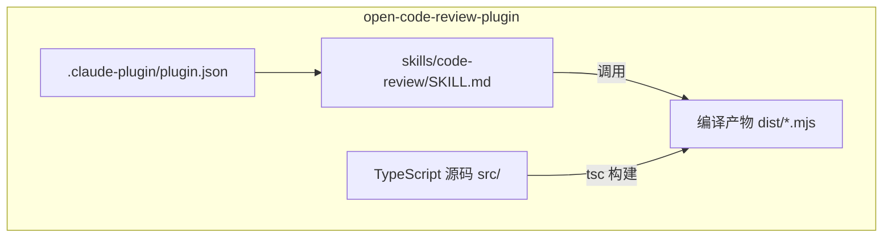

# open-code-review-plugin 初始化共识

## 项目概述

将 `open-code-review`（Go CLI 工具）的代码评审能力，重新封装为符合 [Claude Code 插件规范](https://code.claude.com/docs/zh-CN/plugins) 的插件形态：通过 `skills/code-review` 提供对 git diff 的智能审查能力，并产出 Markdown 报告。

> 上图描述核心交互链路：用户在 Claude Code 中触发 skill → 插件读取 git diff → 生成评审报告。

## 核心问题

1. **形态转换**：参考 `/Users/lixiangyang/Desktop/代码/open-code-review/` 的 Go 实现，将评审逻辑改写为 Claude Code 插件能调用的形式。
2. **技术栈切换**：使用 **TypeScript** 编写源码，编译/运行时产物为 **mjs** 模块，符合 Claude Code 插件运行时要求。
3. **插件骨架**：建立标准目录结构 `.claude-plugin/plugin.json` + `skills/code-review/SKILL.md`。
4. **核心能力**：`code-review` skill 能对当前仓库的 git diff 进行评审，输出结构化的 Markdown 报告。

## 关键目标

- ✅ 产出可被本地 Claude Code 加载并运行的插件包
- ✅ `code-review` skill 完成对 git diff 的自动评审
- ✅ 输出格式为 Markdown 的评审报告（便于人类阅读 / CI 集成）
- ✅ TypeScript 源码 + mjs 执行产物，构建链路清晰
- ✅ 在本地 Claude Code 中完成端到端验证

## 架构影响

> 上图描述插件内部结构：manifest 声明 skill，skill 声明能力并调用 mjs 入口，mjs 由 TypeScript 编译而来。

## SDD 流程计划

按顺序推进以下阶段（每阶段产物落在 `codespec/changes/main/` 下）：

1. **research**：调研 Claude Code 插件规范、`open-code-review` 现有评审逻辑、SKILL.md 写法、TS→mjs 构建链。
2. **requirements**：明确 skill 的输入/输出契约、支持的 git diff 范围、报告字段、错误处理。
3. **design**：设计插件目录结构、TypeScript 模块拆分、SKILL.md 指令、构建脚本与运行入口。
4. **tasks**：拆解为可执行任务（骨架搭建、核心评审逻辑迁移、报告生成、本地联调）。
5. **implementation**：按任务实现并构建出 mjs 产物。
6. **verification**：在本地已安装的 Claude Code 中加载插件、对样例 diff 执行评审、校验报告。

---

## 用户原始需求

> 项目名称：open-code-review-plugin
> 目标：实现 Claude Code 插件版本的 open-code-review。
>
> 具体需求：
> 1. 参考 /Users/lixiangyang/Desktop/代码/open-code-review/ 源代码
> 2. 参考 https://code.claude.com/docs/zh-CN/plugins 了解 Claude Code 插件开发方式
> 3. 用 TypeScript 实现，执行时用 mjs
> 4. 插件结构：.claude-plugin/plugin.json + skills/code-review/SKILL.md
> 5. 核心 skill：code-review，能对 git diff 进行 review 并输出 markdown 报告
>
> 参考资料：
> - 源代码：/Users/lixiangyang/Desktop/代码/open-code-review/
> - 目标项目：/Users/lixiangyang/Desktop/代码/open-code-review-plugin/
> - 本地已安装 ClaudeCode，可供验证
