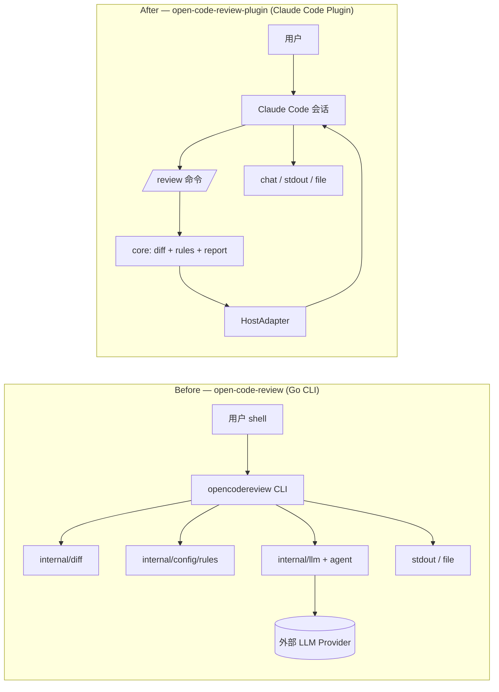
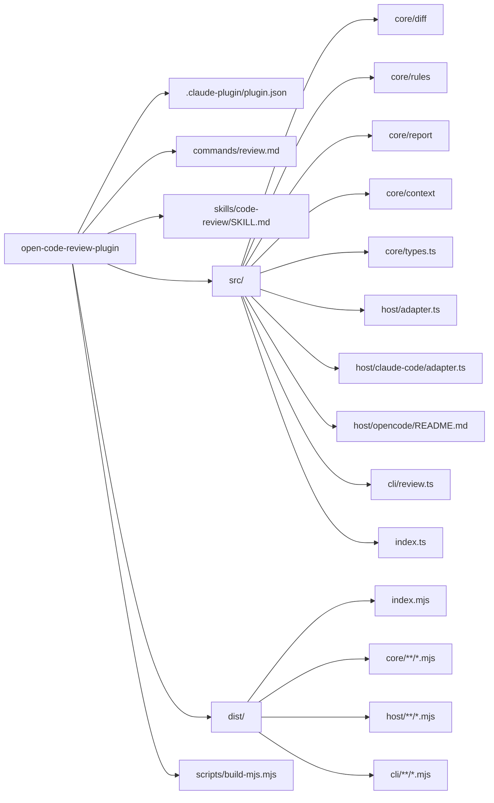
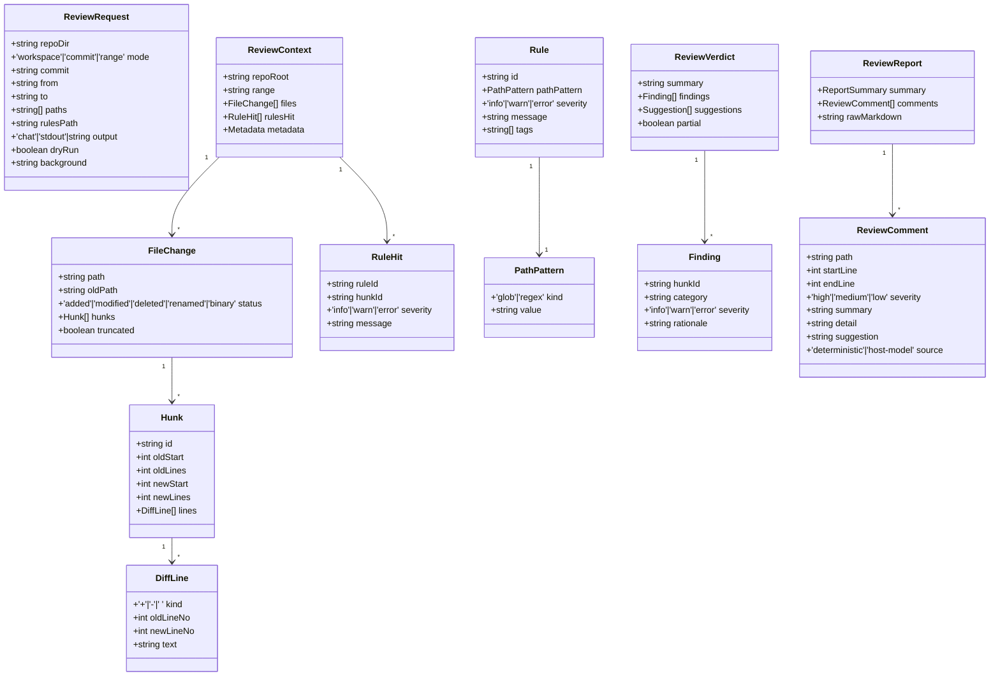
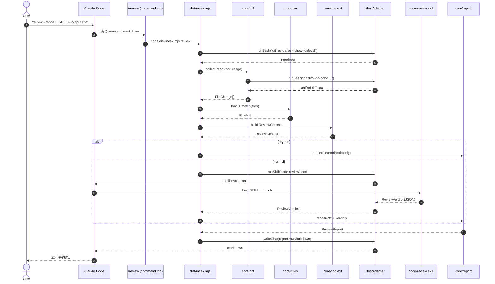
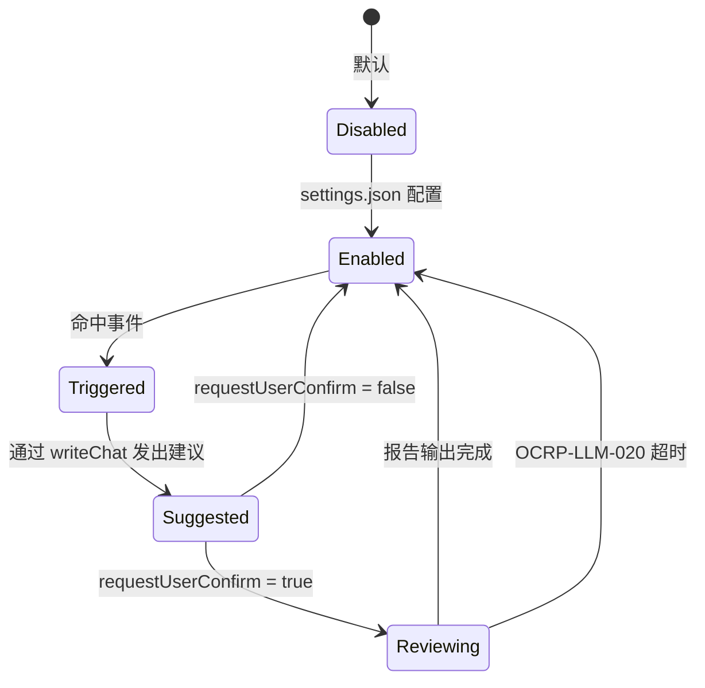
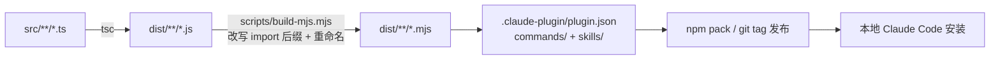
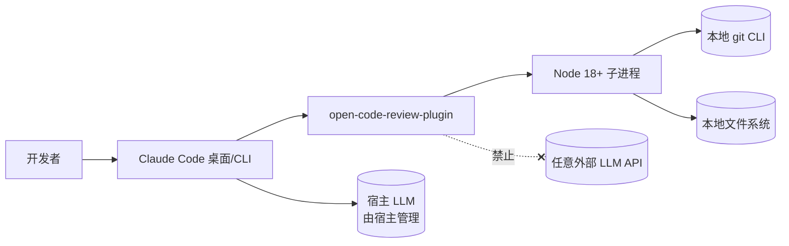

# AR-OCRP-001 Design 增量设计（delta-design）

> 本文件描述对项目全量 DESIGN.md 的**增量变更**。由于 `open-code-review-plugin` 是新建仓库，本增量等价于"初版设计的差异化呈现"，合并后即为 DESIGN.md 主线内容。
>
> 路径约定：
> - 项目根：`/Users/lixiangyang/Desktop/代码/open-code-review-plugin`
> - 特性目录：`/Users/lixiangyang/Desktop/代码/open-code-review-plugin/codespec/changes/refactor-as-plugin`
> - 上游 spec：`/Users/lixiangyang/Desktop/代码/open-code-review-plugin/codespec/changes/refactor-as-plugin/codespec/changes/refactor-as-plugin/spec.md`
> - 参考源项目：`/Users/lixiangyang/Desktop/代码/open-code-review`（Go 实现，仅作算法/模板移植参考）

---

## 1. 设计背景

### 1.1 设计目标

1. 用最小代价把 `open-code-review` 的**确定性评审能力**（git diff 解析、path-based 规则匹配、Markdown 报告渲染）以 **TypeScript** 重写并以 **`dist/*.mjs`** 形态接入 Claude Code 插件运行时。
2. 所有 LLM 推理统一委托给宿主 Claude Code 会话；本插件零外部 LLM 调用、零 API Key 配置。
3. 通过 **HostAdapter 抽象层** 把"评审核心引擎"与"宿主交互"解耦，支持后续接入 opencode 等其它 Agent 宿主。
4. 设计兼容 spec.md 中所有数据契约（`ReviewContext / ReviewVerdict / Rule / Finding`）与错误码（`OCRP-LOAD-* / OCRP-RUN-* / OCRP-LLM-* / OCRP-RULES-* / OCRP-SKILL-* / OCRP-HOOK-*`）。
5. 与已存在的脚手架 (`src/index.ts`、`commands/review.md`、`package.json`、`scripts/build-mjs.mjs`) 风格一致、可平滑演进。

### 1.2 设计约束

- 运行时：Node ≥ 18，ESM；产物只允许 `dist/**/*.mjs`。
- TypeScript 严格模式（`strict: true`）；运行时零外部 npm 依赖优先（只用 Node 内置 + `git` 子进程）。
- `core/*` 模块 **禁止** import `host/*` 与任何 Claude Code 专属符号。
- 插件 manifest **禁止** 出现 `apiKey / provider / model / baseUrl / endpoint` 等字段。
- 所有"判断/总结/分类"必须通过 `HostAdapter.runSkill('code-review', ctx)` 委托。
- 与 `open-code-review` 现有规则文件、报告模板保持兼容（同输入 → 同 deterministic 输出）。

### 1.3 非目标

- 不实现 opencode HostAdapter（仅占位 + 文档）。
- 不实现 PR 平台集成（GitHub/GitLab API）。
- 不引入 AST 级静态分析。
- 不保留 Go CLI（独立二进制不再发布）。
- 不内置任何 LLM Provider 客户端代码。
- 不实现可视化报告（Web UI / TUI）。

---

## 2. 设计决策

### 2.1 推理委托方式：Skill 调用而非 SDK / HTTP

**决策**：插件通过 **Claude Code 的 Skill 调用机制**把 `ReviewContext` 交还宿主会话推理；不引入任何 LLM SDK 或 HTTP 客户端。

**背景**：spec 要求推理零外发，但仍需结构化模型结论。

**方案对比**：

| 方案 | 优点 | 缺点 |
|------|------|------|
| A · Skill 调用（采纳） | 完全合规、复用宿主 prompt 工程、结构化输入输出 | 依赖宿主 skill 解析能力 |
| B · 嵌入 Anthropic SDK + 透传宿主 token | 实现简单 | 违反"零外部 LLM 调用"约束 |
| C · 通过 Bash 子进程调起 `claude` CLI | 解耦 | 跨平台不稳定、丢失流式与上下文 |

**理由**：
- A 与官方插件机制对齐，符合 spec §1.3 / §1.5 契约。
- B/C 引入隐形依赖与权限风险，被 spec REMOVED 明确禁止。

### 2.2 评审核心与宿主解耦：HostAdapter 接口

**决策**：定义 `HostAdapter` 接口（`runSkill / writeChat / requestUserConfirm / readFile / runBash`）作为核心与宿主之间的唯一边界。`core/*` 仅依赖该接口的类型，不依赖具体宿主实现。

**理由**：
- 满足 spec §1.6 与 US-03 跨宿主复用要求。
- 测试侧可注入 `MockHostAdapter` 实现完整流水线单元测试。
- 未来接入 opencode 时新增 `host/opencode/adapter.ts` 即可，不动核心。

### 2.3 Diff 解析：自研轻量解析器 + `git` 子进程

**决策**：用 `child_process.spawn('git', ...)` 拉取 unified diff，自研最小 unified-diff 解析器，移植 `open-code-review/internal/diff` 的状态机逻辑到 TS；不引入 `parse-diff` / `diff` 等 npm 依赖。

**方案对比**：

| 方案 | 优点 | 缺点 |
|------|------|------|
| A · 自研解析（采纳） | 零依赖、行为可控、可逐行复刻 Go 行为 | 需要编写解析代码与单测 |
| B · 用 `parse-diff` | 现成 | 引入 npm 依赖、行为难以严格对齐 Go 版 |
| C · 直接调用 `git diff --json-format`（不存在） | — | git 不支持 |

**理由**：满足"零运行期依赖优先"约束，且 diff 协议稳定，自研可控性高。

### 2.4 规则装载顺序

**决策**：固定为 **CLI `--rules`** → **仓库根 `.code-review.yaml`** → **用户 `~/.code-review/rules.yaml`** → **插件内置默认**，取首个可用源（不合并）。

**理由**：
- 与 spec §2.4 一致，简单可解释。
- 与原 `open-code-review` 的 `rule.json` 装载顺序对齐（仅扩展名换为 yaml/json 双支持）。

### 2.5 构建链路：TSC → JS → MJS 改写

**决策**：保留并完善已有方案 —— `tsc` 输出 ESM `.js`，由 `scripts/build-mjs.mjs` 把所有相对 import 后缀改写为 `.mjs` 并重命名文件；运行期仅依赖 `dist/**/*.mjs`。

**方案对比**：

| 方案 | 优点 | 缺点 |
|------|------|------|
| A · tsc + 后处理改写（采纳） | 零第三方打包、可调试、与现有脚手架一致 | 需自研 mjs 改写脚本 |
| B · esbuild / tsup bundle | 一步到位 | 引入依赖、产物难以审计 |
| C · 直接 `.ts` 运行（loader） | 开发体验好 | 不符合"运行期 mjs"目标 |

**理由**：与 `package.json` 现状一致，最小变更。

### 2.6 模块布局：core / host / cli 三层

**决策**：

```
src/
├── core/              # 与宿主无关的评审核心
│   ├── diff/          # git diff 解析（含 git 子进程封装）
│   ├── rules/         # 规则模型、装载、匹配
│   ├── report/        # Markdown 渲染
│   ├── context/       # ReviewContext / ReviewVerdict 构造与合并
│   └── types.ts       # 共享类型
├── host/              # 宿主适配
│   ├── adapter.ts     # HostAdapter 接口
│   ├── claude-code/   # 默认实现
│   │   └── adapter.ts
│   └── opencode/      # 占位 + 文档（不实现）
│       └── README.md
├── cli/               # /review 命令的入口编排
│   └── review.ts
└── index.ts           # 公共导出 + 公共类型
```

**理由**：满足 spec §1.6 的"core 不 import host"硬约束；目录命名直观，便于静态扫描。

### 2.7 Hooks 默认关闭 + 用户显式开启

**决策**：`plugin.json` 仅**声明可绑定的 hooks**，但默认 `enabled: false`；用户在用户级 `~/.claude/settings.json` 或仓库级 `.claude/settings.json` 中显式开启。

**理由**：与 spec §1.4 一致，避免误触发。

### 2.8 严重等级与原项目对齐

**决策**：内部使用 `info | warn | error` 三档（与 spec 数据约束对齐），渲染到 Markdown 时映射为原项目的 `High / Medium / Low`：
- `error` → High Priority
- `warn`  → Medium Priority
- `info`  → 默认**不输出**到报告（与现有 `commands/review.md` "silently discard Low" 一致）

**理由**：保持下游报告结构对齐，同时上游模型可见三档。

---

## 3. 架构与模块设计

### 3.1 架构总览（变更前后对比）



### 3.2 分层依赖

```mermaid
flowchart TB
    Manifest[.claude-plugin/plugin.json]
    Cmd[commands/review.md<br/>+ skills/code-review/SKILL.md]
    Entry[dist/index.mjs<br/>cli/review.ts]
    Adapter[host/adapter.ts]
    CCAdapter[host/claude-code/adapter.ts]
    Core[core/]
    Diff[core/diff]
    Rules[core/rules]
    Report[core/report]
    Ctx[core/context]
    Types[core/types.ts]
    Node[(Node 18+<br/>child_process / fs / path)]
    Git[(git CLI)]

    Manifest --> Cmd
    Manifest --> Entry
    Cmd --> Entry
    Entry --> Core
    Entry --> Adapter
    Adapter <|.. CCAdapter
    Core --> Ctx
    Core --> Diff
    Core --> Rules
    Core --> Report
    Diff --> Types
    Rules --> Types
    Report --> Types
    Ctx --> Types
    Diff --> Node
    Diff --> Git
    Rules --> Node
    Report --> Node
```

依赖规则（硬约束，design lint 应予以检查）：
- `core/*` 只能 import `core/*` 与 Node 内置；
- `host/*` 可 import `core/types.ts`，**不允许** import `core` 业务模块；
- `cli/*` 可 import `core/*` 与 `host/adapter.ts`，**不允许**直接 import `host/claude-code/*`（通过依赖注入获得 adapter）。

### 3.3 模块树形结构



---

## 4. 数据模型变更

> 本插件无关系型数据库，"数据模型"指 TS 类型契约。沿用 spec.md §4 的领域对象。

### 4.1 新增类型（合并到 `src/core/types.ts`）



**对现有 `src/index.ts` 中已存在类型的兼容性处理**：
- `ReviewComment` 新增 `source: 'deterministic' | 'host-model'` 字段，**默认值为 `'host-model'`**，保留对原 schema 的向前兼容。
- `DiffEntry` 保留为 `index.ts` 导出，内部演进为 `FileChange` —— 在 `index.ts` 中通过 `type DiffEntry = FileChange` 别名维护对外兼容。
- 新增 `ReviewContext / ReviewVerdict / Rule / RuleHit / Finding` 等类型，集中在 `core/types.ts`，由 `index.ts` re-export。

### 4.2 修改类型

| 类型 | 字段 | 原类型 | 新类型 | 说明 |
|------|------|--------|--------|------|
| `ReviewRequest` | `mode` | `'workspace'|'commit'|'range'` | 不变 | 增加 `paths / rulesPath / output / dryRun / background` 字段 |
| `ReviewComment` | `source` | (无) | `'deterministic'|'host-model'` | 满足 spec §2.3 |
| `Rule.pathPattern` | — | `string` | `PathPattern { kind, value }` | 满足 spec §4.7 |
| `Rule.severity` 默认 | — | 等价 info | 默认 `warn` | 满足 spec §4.7 |

### 4.3 配置文件 Schema（YAML / JSON 双格式）

```yaml
# .code-review.yaml （仓库级）/ ~/.code-review/rules.yaml（用户级）
version: 1
rules:
  - id: NO-CONSOLE-LOG
    path: { kind: glob, value: "src/**/*.ts" }
    severity: warn
    message: "Avoid console.log in src/**/*.ts (hit {{path}}:{{line}})"
    tags: [lint, hygiene]
ignorePaths:
  - "dist/**"
  - "**/*.snap"
review:
  maxHunkLines: 800
  truncateMarker: "... (truncated)"
```

---

## 5. 接口设计变更

### 5.1 内部 API：`HostAdapter` 接口

```ts
// src/host/adapter.ts
export interface HostAdapter {
  /** 调用宿主侧 skill，返回结构化 verdict。 */
  runSkill(
    skillId: 'code-review' | string,
    context: ReviewContext,
    opts?: { timeoutMs?: number }
  ): Promise<ReviewVerdict>;

  /** 将 markdown 直接写入宿主会话（chat 输出目标使用）。 */
  writeChat(markdown: string): Promise<void>;

  /** 请求用户确认（hooks 建议链路使用）。 */
  requestUserConfirm(prompt: string): Promise<boolean>;

  /** 通过宿主能力读取文件（避免直连 fs 时的权限漂移）。 */
  readFile(absPath: string): Promise<string>;

  /** 通过宿主能力执行 bash 命令（git 子进程默认走此通道）。 */
  runBash(cmd: string, opts?: { cwd?: string }): Promise<{ stdout: string; stderr: string; exitCode: number }>;
}
```

**Claude Code 默认实现**（`src/host/claude-code/adapter.ts`）：
- `runSkill` → 写入一段约定的 prompt 描述 + 上下文 JSON，触发 `code-review` skill，解析其 fenced JSON 输出。
- `writeChat` → 通过 stdout 把 Markdown 喂回宿主会话（命令脚本即被会话直接 capture）。
- `requestUserConfirm` → 通过 Markdown 提示 + 等待下一条用户消息（最简版本可降级为"始终返回 false 并提示用户手动确认"）。
- `readFile` / `runBash` → 直接走 Node `fs.promises.readFile` 与 `child_process.spawn`，但在签名上仍走 HostAdapter，便于 mock 与未来宿主替换。

### 5.2 内部 API：核心入口

```ts
// src/cli/review.ts
export async function runReview(
  req: ReviewRequest,
  host: HostAdapter
): Promise<ReviewReport>;
```

**职责**：参数校验 → 调用 `core/diff` → `core/rules` → 组装 `ReviewContext` → `host.runSkill('code-review', ctx)` →（dry-run 时跳过）→ 合并 `RuleHit` + `Finding` → `core/report` 渲染 → 选定输出目标。

### 5.3 错误码体系

| 错误码 | 类别 | 说明 |
|--------|------|------|
| `OCRP-LOAD-001` | 加载 | manifest 校验失败 |
| `OCRP-LOAD-002` | 加载 | `dist/` 缺失 |
| `OCRP-RUN-010` | 运行 | 非 git 仓库 |
| `OCRP-RUN-011` | 运行 | 参数互斥（`--staged` 与 `--range`） |
| `OCRP-LLM-020` | 委托 | 宿主推理超时 |
| `OCRP-RULES-030` | 规则 | 规则文件解析失败 |
| `OCRP-SKILL-040` | 解析 | Skill 输出无法解析为合法 Verdict |
| `OCRP-HOOK-050` | Hook | hook 已开启但目标命令未注册 |

错误对象统一形态：
```ts
class OcrpError extends Error {
  code: `OCRP-${string}`;
  hint?: string;
  cause?: unknown;
}
```

### 5.4 关键调用时序



### 5.5 Hooks 状态机



---

## 6. 构建与部署

### 6.1 构建链路



构建脚本（沿用 `package.json`）：
- `npm run clean` → 清 `dist/`
- `npm run build:tsc` → tsc 输出 ESM `.js`
- `npm run build:mjs` → 改写 import 与文件后缀为 `.mjs`
- `npm run build` → clean + tsc + mjs

### 6.2 安装与加载


安装方式（本期支持）：
1. **本地开发**：将仓库目录软链到 `~/.claude/plugins/open-code-review-plugin`。
2. **打包安装**：`npm pack` → 产出 tgz → 解压到插件目录。
3. CI/CD 与官方插件市场分发推迟到后续里程碑。

### 6.3 运行时拓扑



---

## 7. 风险与缓解

| 风险 | 可能性 | 影响 | 缓解措施 |
|------|--------|------|----------|
| Claude Code 插件 API 仍在演进，字段或机制变动 | 中 | 高 | 仅依赖文档化稳定接口；HostAdapter 隔离变更面；CI 内嵌一次端到端冒烟 |
| 宿主返回非结构化文本无法解析为 `ReviewVerdict` | 中 | 中 | Skill prompt 强制 JSON fenced 块；解析失败降级为 `OCRP-SKILL-040` + 原文嵌入 |
| 大 diff 导致一次会话上下文超限 | 中 | 中 | 按文件迭代调用 skill；超过 `maxHunkLines` 截断并标 `truncated` |
| `git` CLI 缺失或版本过低 | 低 | 高 | 启动时检测；失败抛 `OCRP-RUN-010` + 安装提示 |
| Windows 路径分隔符与 glob 匹配差异 | 中 | 中 | 内部路径统一为 POSIX；Windows 仅"尽力支持"，文档注明 |
| 规则文件兼容性破坏既有用户 | 低 | 中 | 保留原 `rule.json` 加载；YAML 仅作为新增格式 |
| `dist/*.mjs` 改写脚本回归 | 低 | 高 | `scripts/build-mjs.mjs` 单测；构建后 `node --check dist/index.mjs` 冒烟 |
| Hooks 误触发产生骚扰 | 低 | 低 | 默认全关；任何触发都通过 `requestUserConfirm` 二次确认 |

---

## 8. 待解决问题

- HostAdapter 中 `requestUserConfirm` 在 Claude Code 当前命令脚本运行模型下的具体实现路径（是用 Markdown 提示等待下一条 user 消息？还是依赖未来 hook 回调？）— 进入 implement 阶段前需小样验证。
- `code-review` skill 输出契约的 fenced JSON 是否在所有 Claude Code 版本上稳定可达，预案：失败时回退为纯文本嵌入 + `partial=true`。
- 仓库级 `.code-review.yaml` 与原 `.opencodereview/rule.json` 的双轨支持时长（建议保留 2 个 minor 版本后弃用）。
- opencode 适配器接口是否需要超出现有 HostAdapter 的方法（待 opencode 文档对齐）。
- 规则文件 schema 是否需要支持继承/include（本期不做，后续 P2）。

---

## 合并检查清单

- [ ] 设计决策（§2）已纳入 DESIGN.md "技术选型" 章节
- [ ] 模块布局（§2.6, §3.3）已纳入 DESIGN.md "代码组织" 章节
- [ ] 数据模型（§4）已对齐 spec.md §4 与 `src/core/types.ts`
- [ ] `HostAdapter` 接口（§5.1）已落到 `src/host/adapter.ts`
- [ ] 错误码表（§5.3）已与 spec.md 错误码同步并放入附录
- [ ] 时序图（§5.4）已纳入 DESIGN.md "关键流程" 章节
- [ ] 构建与部署（§6）已纳入 DESIGN.md "构建发布" 章节
- [ ] 风险与缓解（§7）已纳入 DESIGN.md "风险登记"
- [ ] 待解决问题（§8）已开 Issue 跟踪
- [ ] 所有 mermaid 图表在文档预览中渲染正常

---

## 约束

- 设计风格与 `src/index.ts` 现有注释中声明的"design invariant"完全一致：**不引入任何外部 LLM 调用**。
- 每个设计决策（§2.x）均给出方案对比或理由。
- 与现有脚手架（`commands/review.md`、`scripts/build-mjs.mjs`、`package.json`）兼容，零破坏性改动。
- 所有路径以绝对路径为权威：
  - 输出文件：`/Users/lixiangyang/Desktop/代码/open-code-review-plugin/codespec/changes/refactor-as-plugin/codespec/changes/refactor-as-plugin/design.md`
  - 上游 spec：`/Users/lixiangyang/Desktop/代码/open-code-review-plugin/codespec/changes/refactor-as-plugin/codespec/changes/refactor-as-plugin/spec.md`
  - 参考源项目：`/Users/lixiangyang/Desktop/代码/open-code-review`
