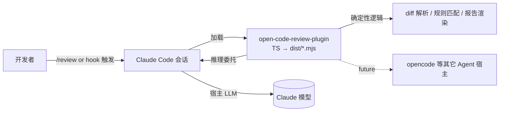
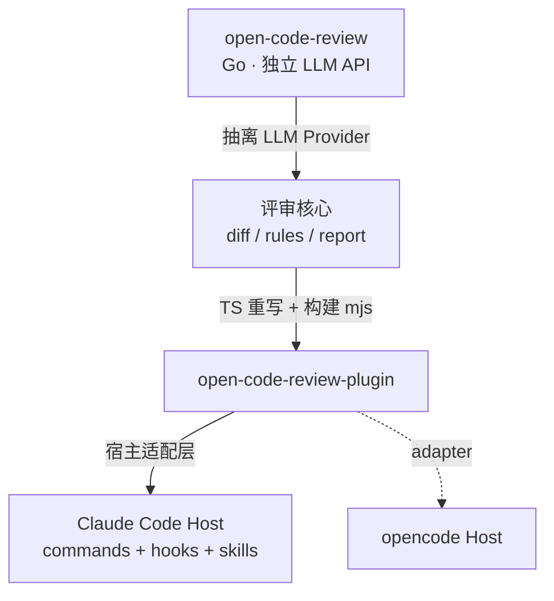

# Init · open-code-review-plugin（Claude Code 插件化重构）

> 工作目录：`/Users/lixiangyang/Desktop/代码/open-code-review-plugin/codespec/changes/refactor-as-plugin`
> 参考源项目：`/Users/lixiangyang/Desktop/代码/open-code-review`（Go CLI + 独立 LLM API）
> 插件文档：`https://code.claude.com/docs/zh-CN/plugins`
> 本地已安装 Claude Code，可用于端到端验证

## 1. 项目概述

将 `open-code-review`（Go CLI，自调外部 LLM API）重构为 **Claude Code 官方插件 `open-code-review-plugin`**：

- 形态：`.claude-plugin/` + `commands/` + `skills/` + **hooks**，由 Claude Code 宿主直接加载；
- 语言：**TypeScript 源码**，构建产物为 **`dist/*.mjs`**，运行期 `node` ≥18 直接执行；
- **核心转变**：插件不再持有任何 LLM 凭证 / Provider / API 客户端，"模型推理"全部委托给宿主 Claude Code 当前会话；插件只承担**确定性工程** —— git diff 解析、规则匹配、上下文打包、Markdown 报告渲染；
- **复用优先**：最大化复用 `open-code-review` 中与 LLM 无关的成熟逻辑（diff/hunk 解析、path-based 规则、报告模板），仅做语言/形态适配（Go → TS）；
- **可扩展**：通过 provider/adapter 抽象保留扩展到 **opencode 等其它 Agent 宿主**的入口。

> 图1：核心调用链 —— 插件不直连任何 LLM API，推理路径完全经由宿主 Claude Code 会话；provider 抽象层为后续 opencode 等宿主预留接入点。

## 2. 核心问题

1. **形态转换**：独立 Go CLI → Claude Code 插件（`.claude-plugin/plugin.json` + `commands/review.md` + `skills/code-review` + hooks）。
2. **职责剥离**：去掉 `internal/agent`、`internal/llm`、API Key 管理、Provider 协议适配 —— 把"动态决策"交还宿主；把 diff 解析、规则匹配、报告渲染留在 TS 侧。
3. **复用原项目逻辑**：识别 Go 侧可直接平移的算法/规则/模板，最小代价 TS 化，避免重写。
4. **接入触发链**：通过 Claude Code 的 **slash command（`/review`）** 与 **hooks**（如 PostToolUse / Stop / 自定义事件）触发评审，无需独立进程或外部调度。
5. **构建链路**：`tsc` 输出 `.js` → `scripts/build-mjs.mjs` 改写 import + 重命名 → 运行期仅依赖 `dist/*.mjs`。
6. **跨宿主扩展**：评审核心引擎不绑定 Claude Code，可被 opencode 等其它 Agent 宿主复用。

> 图2：架构演进 —— 抽离 LLM Provider，沉淀"评审核心 + 宿主适配层"为可在多 Agent 宿主复用的资产。

## 3. 关键目标

- ✅ 以 Claude Code 官方插件规范交付（`.claude-plugin/plugin.json`、`commands/review.md`、`skills/code-review/`、`dist/*.mjs`）；
- ✅ 提供 `/review` 命令与必要 hooks，开箱即用地对当前仓库 / PR / 本地 diff 发起评审；
- ✅ 推理决策全部委托宿主 Claude Code，**插件零外部 LLM 依赖、零 API Key 配置**；
- ✅ TS 严格模式 + ESM + Node ≥18，运行时零/极少外部依赖；
- ✅ 最大化复用 `open-code-review` 的 diff/rules/report 核心，不迁移 `internal/agent`、`internal/llm`；
- ✅ 保留 provider/adapter 抽象与扩展文档，为 opencode 等宿主预留接入；
- ✅ 能在本地已安装的 Claude Code 中完成安装 → 加载 → `/review` 端到端验证。

## 4. SDD 流程计划

后续按标准 SDD 阶段推进，每阶段产物写入本特性目录，本 `init.md` 只做初始化共识，不展开细节：

- **research** —— 调研 Claude Code 插件机制（plugin.json / commands / skills / hooks）与 `open-code-review` Go 代码，输出"可复用 / 需重写 / 需丢弃"模块清单；
- **proposal** —— 交付物、范围边界、验收标准；
- **spec** —— `/review` 命令与 skill 契约、hooks 绑定点、宿主交互数据 schema、错误处理；
- **design** —— 插件目录结构、TS 模块拆分、provider/adapter 抽象、构建链路、opencode 扩展点；
- **tasks** —— 可独立交付的任务清单（脚手架、diff 解析移植、规则引擎移植、报告渲染、命令/hooks/skill 接入、构建脚本、本地验证）；
- **implement / verify** —— 按任务实现，构建 `dist/*.mjs`，在本地 Claude Code 中安装并跑通 `/review`，与原 `open-code-review` 输出对齐校验。

---

## 用户原始需求

> 来实现 open_code_review_plugin，是想实现claudecode的插件，而不用想open code review那样子单独去调用独立的api；
> 具体需求为上边介绍， 可参考资料：/Users/lixiangyang/Desktop/代码/open-code-review/ open-code-review源代码、代码阅读和样例，我期望最后使用ts来实现，执行的时候用js、mjs等来执行； 你可以使用 ` ` https://code.claude.com/docs/zh-CN/plugins ` ` ，查看插件怎么安装，同时我本地也安装了ClaudeCode，可供验证；
> 我期望你尽可能是复用原有逻辑和代码，使用ClaudeCode本身的钩子+plugin来实现 open-code-review能够在代码上的provider直接调用的ClaudeCode的，同时期望后续也能扩展到opencode等场景上；
