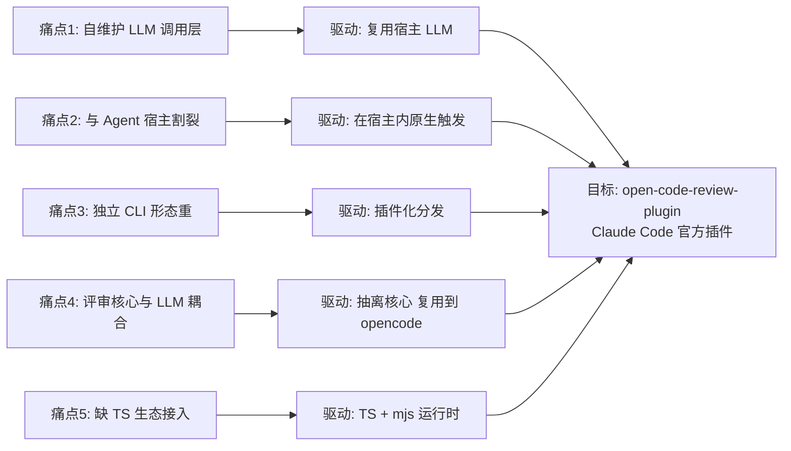
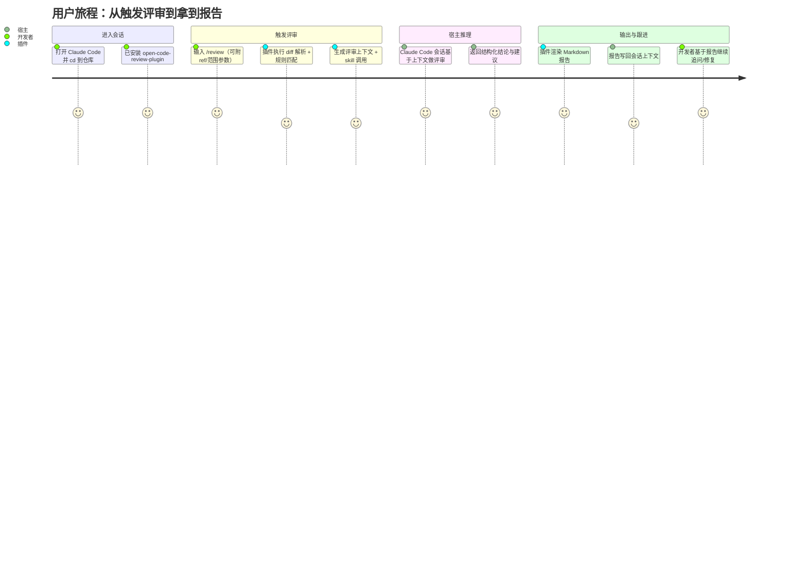
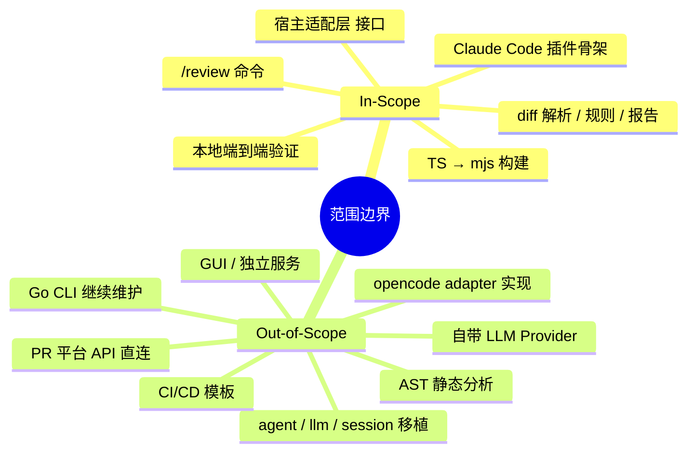
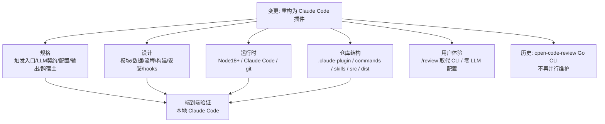

# AR-OCRP-001 需求澄清 · open-code-review-plugin（Claude Code 插件化重构）

<!--
注意：本文件为 SDD「需求提案」阶段产物。
功能清单、用户故事、不在范围、依赖项等条目数量按实际推断填写；
信息缺失处标注「待确认」，将在 spec / design 阶段闭环。
-->

## 1. 背景与动机

### 1.1 现状痛点

原项目 `open-code-review`（Go CLI）当前形态存在以下问题：

1. **重复造轮子的 LLM 调用层**：自维护 `internal/llm`、`internal/agent`、Provider 适配、API Key 管理、限流/重试，对用户来说还要额外配置 Provider 与 Token。
2. **与 Claude Code / opencode 等 Agent 宿主割裂**：开发者已在 Claude Code 中工作，却需要切换到独立 CLI 进程发起评审，上下文（当前 diff、当前文件、当前会话）无法天然共享。
3. **运行形态重**：独立二进制 + Go 工具链，分发、升级、嵌入到 IDE / Agent 场景的成本高。
4. **扩展面窄**：核心评审逻辑（diff 解析、规则、报告渲染）与 LLM 调用强耦合，无法被其它 Agent 宿主（如 opencode）复用。
5. **TS 生态缺失**：无法直接以 Node/TS 插件形式集成到现代 AI 编程工具链。

### 1.2 业务驱动

- **复用宿主能力**：Claude Code 已提供模型、工具、上下文、权限、UI，插件化后零 LLM 配置即可使用，体验显著优于独立 CLI。
- **沉淀可复用资产**：把"评审核心引擎"从特定语言/特定 Provider 中抽离，作为跨 Agent 宿主（Claude Code → opencode → …）的共享资产。
- **降低用户门槛**：用户安装一个 Claude Code 插件即可获得代码评审能力，无需 API Key、无需独立进程、无需配置 Provider。
- **拥抱官方插件生态**：跟随 Claude Code Plugin 规范，享受插件分发、更新、权限模型等基础设施红利。

> 图1：现状痛点 → 业务驱动 → 目标 的因果传导关系。

## 2. 变更内容

### 2.1 功能清单

| 功能ID | 功能名称 | 优先级 | 说明 |
|--------|----------|--------|------|
| F-01 | Claude Code 插件骨架（`.claude-plugin/plugin.json` + 安装结构） | P0 | 按官方规范交付可被 Claude Code 加载的插件 |
| F-02 | `/review` slash command | P0 | 触发对当前仓库 / 暂存区 / 指定 ref 的评审 |
| F-03 | git diff 解析（hunk / file / rename / binary） | P0 | TS 移植 `open-code-review/internal/diff` 与 `gitcmd` 的确定性逻辑 |
| F-04 | path-based 规则引擎（规则匹配 + 命中项汇总） | P0 | TS 移植规则匹配核心，规则文件可由仓库或插件内置提供 |
| F-05 | Markdown 报告渲染 | P0 | 复用原报告结构，输出到 stdout / 文件 / Claude Code 会话 |
| F-06 | 推理委托宿主 Claude Code（无独立 LLM 客户端） | P0 | 通过 skill / command 模板把"判断/总结"任务交还宿主会话执行 |
| F-07 | `code-review` skill | P0 | 把"如何评审一段 diff"的提示工程沉淀为 skill，供宿主调用 |
| F-08 | Claude Code hooks 接入（如 PostToolUse / Stop / UserPromptSubmit） | P1 | 在合适事件上自动触发评审或建议评审 |
| F-09 | provider/adapter 抽象层（HostAdapter 接口） | P1 | 把"宿主交互"收敛为接口，Claude Code 为首个实现 |
| F-10 | opencode 扩展占位与文档 | P2 | 文档化如何把核心引擎接入 opencode，预留接口但不实现 |
| F-11 | TS → `dist/*.mjs` 构建链路 | P0 | `tsc` + `scripts/build-mjs.mjs`，运行期仅依赖 mjs，Node ≥18 |
| F-12 | 本地 Claude Code 端到端验证脚本/指南 | P1 | 安装、加载、`/review` 跑通的可复现步骤 |
| F-13 | 多语言/多仓库 diff 兼容（rename / 二进制 / 大 diff 截断） | P1 | 与原项目对齐，避免回归 |
| F-14 | 评审结果回写到 Claude Code 会话上下文 | P1 | 让宿主能继续基于评审结果对话 |

> 优先级定义：P0 MVP 必须，P1 重要增强，P2 未来优化

### 2.2 用户故事

**US-01**：作为使用 Claude Code 的开发者，我希望在仓库目录中输入 `/review`，就能对当前 working tree / 暂存区 / 指定 ref 的 diff 直接得到一份评审报告，以便不切换工具完成 code review。

**验收标准**：
- [ ] 安装插件后，Claude Code 中 `/review` 可见且可执行
- [ ] 无需任何外部 LLM API Key 即可工作
- [ ] 报告包含：变更概览、按文件/规则的发现项、风险等级、建议
- [ ] 评审结论由当前 Claude Code 会话的模型给出（非插件自调 API）

**US-02**：作为插件开发者/维护者，我希望复用 `open-code-review` 已有的 diff 解析、规则匹配、报告模板，以便最小代价完成 Go → TS 的形态迁移。

**验收标准**：
- [ ] diff 解析输出结构与原项目语义对齐（文件、hunk、行号、新增/删除）
- [ ] 路径规则匹配结果与原项目一致（同一组规则 + 同一份 diff → 同一组命中）
- [ ] 报告 Markdown 结构沿用原项目模板（标题/章节/字段）

**US-03**：作为愿意把评审能力接到 opencode 等其它 Agent 宿主的工程师，我希望评审核心引擎不绑定 Claude Code，以便后续通过实现 HostAdapter 接入 opencode。

**验收标准**：
- [ ] 评审核心模块（diff/rules/report）不 import 任何 Claude Code 专属符号
- [ ] HostAdapter 接口存在且 Claude Code 实现独立于核心
- [ ] 文档说明 opencode 接入步骤（即便不在本期实现）

**US-04**：作为不希望管理 LLM Token 的用户，我希望插件零外部 API Key 配置，所有模型调用都走宿主 Claude Code 会话。

**验收标准**：
- [ ] 插件代码与 manifest 中无任何 API_KEY / model 配置项
- [ ] 不存在 `internal/llm` 类似的 LLM 客户端代码

> 图2：US-01 的核心用户旅程 —— 触发、解析、推理委托、报告、跟进。

### 2.3 不在范围内

- ❌ 自带 LLM Provider / API Key / 模型调用（推理一律交还宿主）
- ❌ Web UI / 桌面 GUI / 独立服务进程
- ❌ 直接对接 GitHub/GitLab PR API（如需，由宿主或后续扩展承担）
- ❌ 迁移 `open-code-review/internal/agent`、`internal/llm`、`internal/session` 等与外部 LLM 强耦合的模块
- ❌ 多语言 AST 级别静态分析（保持 diff + 规则 + LLM 解释的现有边界）
- ❌ 本期不实现 opencode adapter，仅保留接口与文档占位
- ❌ Go 二进制的继续维护（本插件不与 Go CLI 并行发版）
- ❌ CI/CD 集成模板（如 GitHub Actions workflow）—— 后续可作为独立扩展

> 图3：In-Scope 与 Out-of-Scope 范围边界。

## 3. 影响分析

### 3.1 受影响的规格

| 规格章节 | 变更类型 | 说明 |
|----------|----------|------|
| 5.1 触发入口 | 新增 | 增加 Claude Code `/review` slash command 与 hooks 触发点 |
| 5.2 LLM 调用契约 | 移除/替换 | 删除"自调 LLM Provider"的旧契约，新增"委托宿主会话"的契约 |
| 5.3 配置项 | 简化 | 去除 API Key / Provider / Model 配置；保留规则文件、范围、输出路径等纯参数 |
| 5.4 输出契约 | 保留+扩展 | Markdown 报告结构沿用，新增"回写宿主会话上下文" |
| 5.5 跨宿主能力 | 新增 | HostAdapter 接口规格 + opencode 扩展占位 |

### 3.2 受影响的设计

| 设计章节 | 变更类型 | 说明 |
|----------|----------|------|
| 3.1 模块划分 | 重构 | 拆为 `core/diff`、`core/rules`、`core/report`、`host/claude-code`、`host/<future>` |
| 3.2 数据模型 | 保留 | Diff/Hunk/File/Finding/Report 模型与原项目对齐 |
| 3.3 流程编排 | 新增 | `/review` → parse → match → 委托宿主 → render → 回写 的流水线 |
| 3.4 构建链路 | 新增 | `tsc → dist/*.js → build-mjs.mjs → dist/*.mjs` |
| 3.5 安装与加载 | 新增 | `.claude-plugin/plugin.json`、`commands/review.md`、`skills/code-review/SKILL.md` |
| 3.6 hooks 绑定 | 新增 | PostToolUse / Stop / UserPromptSubmit 等可选绑定 |

### 3.3 破坏性变更

- **是否有破坏性变更**：是（相对原 `open-code-review` Go CLI）。
- **影响范围**：
  - 用户不再通过 Go 二进制 CLI 运行评审，而是通过 Claude Code 插件触发。
  - 原 `--provider` / `--api-key` 等 CLI 参数与配置消失。
  - 原 `internal/agent`、`internal/llm`、`internal/session` 的行为不再可用（由宿主吸收）。
- **迁移方案**：
  - 新仓库 `open-code-review-plugin` 独立交付，不强制覆盖旧 Go CLI 用户。
  - 文档提供"从 Go CLI 迁移到 Claude Code 插件"指引，说明命令对照、配置项删除清单。
  - 规则文件 / 报告模板格式保持兼容，降低迁移成本。

### 3.4 依赖关系

- 运行时依赖：Node ≥ 18、本地已安装 Claude Code、本地可执行 `git`。
- 构建依赖：`typescript`、`@types/node`（已在 `package.json` 体现）。
- 文档依赖：Claude Code 插件官方文档 `https://code.claude.com/docs/zh-CN/plugins`。
- 源码参考依赖：`/Users/lixiangyang/Desktop/代码/open-code-review/`（仅作为算法/模板移植参考，运行期不依赖）。
- 平台依赖：macOS / Linux 一等支持；Windows 待确认。

> 图4：变更影响范围 —— 规格、设计、运行时、仓库结构、用户体验、历史制品。

## 4. DFX 约束

### 4.1 性能

| 约束项 | 指标 | 优先级 |
|--------|------|--------|
| `/review` 端到端首响（含宿主推理） | ≤ 30s（中等仓库，diff < 2000 行） | P0 |
| diff 解析（确定性部分） | ≤ 500ms（diff < 2000 行）| P0 |
| 规则匹配 | ≤ 200ms（规则数 < 200，文件数 < 200）| P0 |
| 大 diff 截断阈值 | 单 hunk > 阈值时截断并标注，避免 OOM | P1 |
| 插件冷启动（加载 manifest + 入口 mjs） | ≤ 1s | P1 |

### 4.2 可靠性

| 约束项 | 要求 | 优先级 |
|--------|------|--------|
| 非 git 仓库 / 无 diff 场景 | 返回明确错误信息，不抛栈 | P0 |
| 二进制文件 / rename / 大 diff | 优雅降级，标注跳过原因 | P0 |
| 宿主推理失败 / 超时 | 返回已完成的确定性部分 + 失败原因 | P0 |
| 规则文件缺失或格式错误 | 给出可定位的错误位置，不静默吞 | P0 |
| 与原项目输出对齐 | 同 diff + 同规则 → 同命中集合 | P1 |
| 跨平台 | macOS / Linux 一等支持，Windows 待确认 | P1 |

### 4.3 安全 / 隐私

| 约束项 | 要求 | 优先级 |
|--------|------|--------|
| 不外发任何代码到第三方 API | 推理仅经宿主 Claude Code 会话 | P0 |
| 不读取仓库范围外文件 | 默认仅作用于当前 git 仓库 | P0 |
| 不写入未声明路径 | 报告输出路径需显式参数或默认在仓库内 | P0 |

### 4.4 可维护性

| 约束项 | 要求 | 优先级 |
|--------|------|--------|
| TS 严格模式 | `tsconfig` `strict: true` | P0 |
| 核心模块零宿主耦合 | `core/*` 不 import `host/*` | P0 |
| 构建产物可复现 | `npm run build` 在干净环境产物一致 | P1 |

## 5. 里程碑

| 里程碑 | 交付内容 | 完成标志 |
|--------|----------|----------|
| M1 · 骨架可加载 | 插件目录结构、`plugin.json`、最小 `/review` 命令、最小 mjs 入口 | 本地 Claude Code 能识别插件且 `/review` 可见 |
| M2 · 核心可解析 | TS 版 diff 解析 + 规则匹配 + 报告渲染（不接宿主推理） | 对样例 diff 跑通，输出与原项目结构对齐 |
| M3 · 宿主推理打通 | `code-review` skill + 命令模板把上下文交还宿主，宿主返回评审结论 | `/review` 端到端产出包含模型结论的 Markdown 报告 |
| M4 · hooks + 抽象层 | 接入 PostToolUse/Stop 等 hooks、HostAdapter 接口完整 | hooks 可触发评审；core 不 import host 通过 lint |
| M5 · 验证与文档 | 端到端验证脚本/指南、迁移文档、opencode 扩展占位文档 | 复现验证通过；文档评审通过 |

## 约束

- 本提案基于 `init.md` 共识与用户原始需求生成，未与用户进一步确认前，以下条目标注「待确认」：
  - 是否需要支持 Windows 平台（当前默认仅 macOS / Linux 一等支持）。
  - 规则文件来源（仓库内 `.code-review.yaml` / 插件内置默认 / 两者并存）—— 暂按"两者并存，仓库优先"推断。
  - hooks 默认是否启用自动评审（当前默认关闭，需用户显式开启）。
  - 是否提供与 PR 平台（GitHub/GitLab）的最小集成（当前明确放在范围外）。
- 后续 spec / design 阶段需对上述「待确认」项形成结论。
- 所有路径优先使用绝对路径：
  - 项目根：`/Users/lixiangyang/Desktop/代码/open-code-review-plugin`
  - 特性目录：`/Users/lixiangyang/Desktop/代码/open-code-review-plugin/codespec/changes/refactor-as-plugin`
  - 参考源项目：`/Users/lixiangyang/Desktop/代码/open-code-review`
