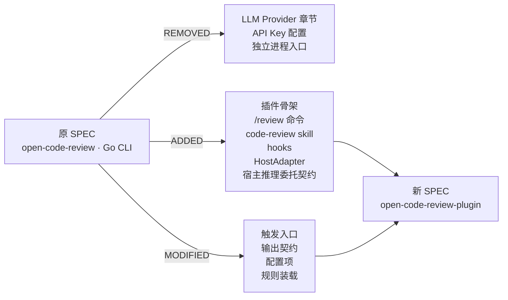
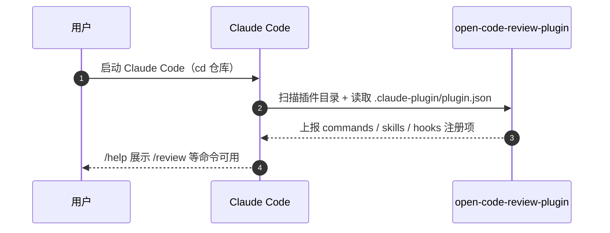
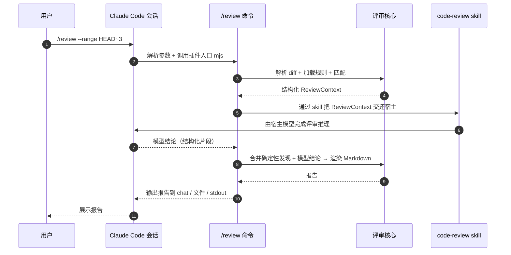
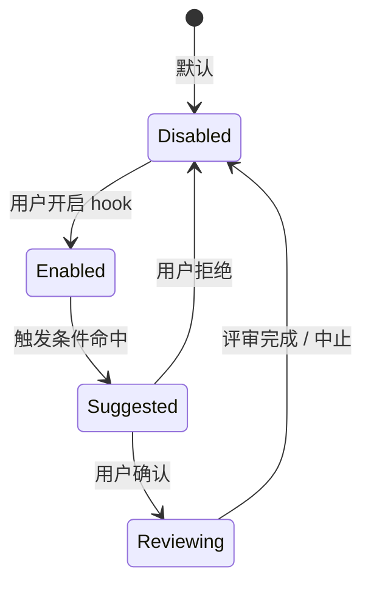
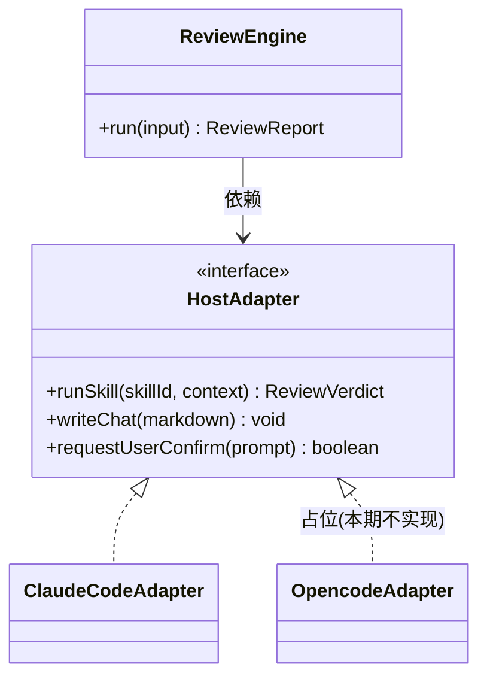
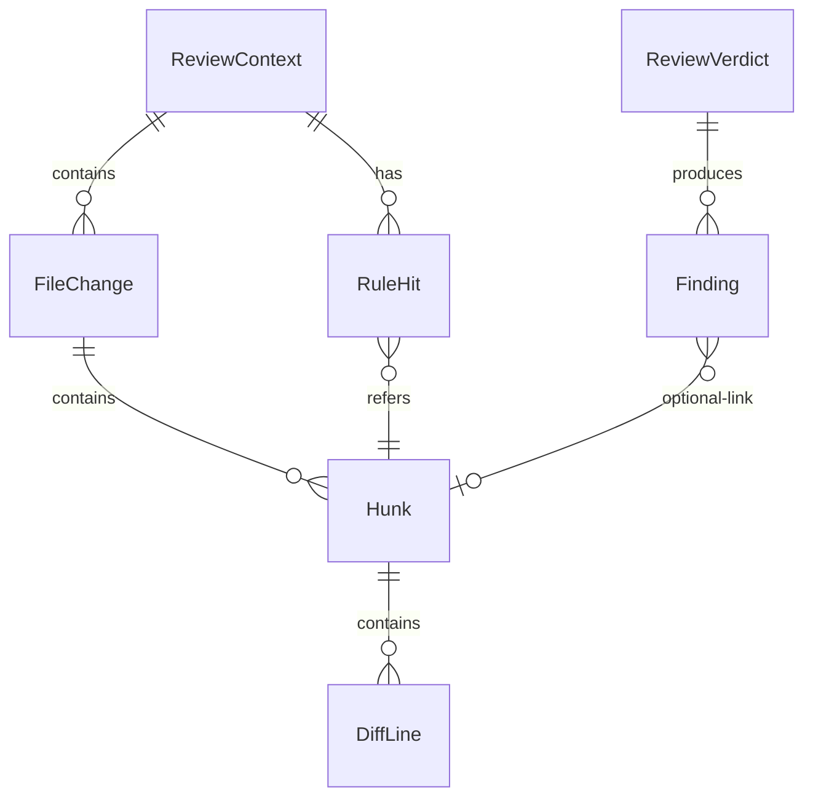

# AR-OCRP-001 Spec 增量设计（delta-spec）

> 本文件描述对项目全量 SPEC.md 的**增量变更**，使用 `ADDED / MODIFIED / REMOVED` 标记。
> 由于本项目此前为 Go CLI（`open-code-review`），此次切换为 Claude Code 插件形态（`open-code-review-plugin`），是对"评审产品规格"的一次重大重构 —— 完成后本增量需合并到新仓库的 SPEC.md。
>
> 路径约定：
> - 项目根：`/Users/lixiangyang/Desktop/代码/open-code-review-plugin`
> - 特性目录：`/Users/lixiangyang/Desktop/代码/open-code-review-plugin/codespec/changes/refactor-as-plugin`
> - 参考源项目：`/Users/lixiangyang/Desktop/代码/open-code-review`
> - 关联文档：`init.md`、`proposal.md`（位于本特性目录）

> 规格变更边界与范围：ADDED 集中在插件形态与宿主交互，MODIFIED 集中在触发入口/输出/配置，REMOVED 集中在自带 LLM 调用与独立进程。

---

## ADDED Requirements

### 1.1 Claude Code 插件骨架（F-01）

#### 1.1.1 业务规则

- **必须** 以 Claude Code 官方插件规范交付：包含 `.claude-plugin/plugin.json`、`commands/`、`skills/`、`dist/` 四类资产。
- **必须** 在 `plugin.json` 中声明插件名、版本、入口、所需权限与命令清单。
- **禁止** 在 manifest 中声明任何外部 LLM API Endpoint 或 API Key 字段。
- **应当** 在 `README.md` 中提供"如何安装到本地 Claude Code"的可复现步骤。

**验收条件**：
- 本地 Claude Code 加载插件目录 → 插件出现在已加载列表，无报错。
- 用户执行 `/help` → 能看到本插件提供的命令（如 `/review`）。
- 检视 `plugin.json` → 无 `api_key` / `provider` / `endpoint` 类字段。

#### 1.1.2 交互流程

#### 1.1.3 异常场景

- **场景**：`plugin.json` 缺失或字段不合规
  - **触发条件**：用户复制不完整的插件目录
  - **系统行为**：Claude Code 拒绝加载并打印缺失字段名
  - **用户感知**：错误码 `OCRP-LOAD-001`，提示「manifest 校验失败：<字段>」

- **场景**：`dist/` 缺失
  - **触发条件**：源码未构建
  - **系统行为**：插件加载失败
  - **用户感知**：错误码 `OCRP-LOAD-002`，提示「请先 `npm run build`」

---

### 1.2 `/review` Slash Command（F-02）

#### 1.2.1 业务规则

- **必须** 注册 `/review` 命令，支持以下入参（位置/具名混合）：
  - `--range <ref-spec>`：评审范围；默认 `HEAD`（即 working tree 相对 HEAD 的变更）。
  - `--staged`：仅评审已暂存内容；与 `--range` 互斥。
  - `--paths <glob,...>`：限定路径集合。
  - `--rules <path>`：规则文件路径，缺省走默认装载顺序。
  - `--output <path|stdout|chat>`：报告输出目标，缺省 `chat`（回写宿主会话）。
- **必须** 在缺少 git 仓库或无任何差异时，给出明确提示并以非异常方式结束。
- **必须** 在执行前打印一行摘要：「将评审 N 个文件 / M 个 hunk / 命中 K 条规则」。
- **禁止** 在 `/review` 内部直接调用任何外部 LLM API；推理统一通过 skill 委托宿主。
- **应当** 支持 `--dry-run`，仅完成确定性部分（解析 + 匹配 + 报告骨架），不触发推理。

**验收条件**：
- `git` 仓库 + 有 diff → 命令返回 exit code 0，产出 Markdown 报告。
- 非 git 目录 → 返回友好错误，exit code 非零，错误码 `OCRP-RUN-010`。
- `--staged` 与 `--range` 同时给出 → 返回错误码 `OCRP-RUN-011`。
- `--dry-run` → 报告中"模型结论"章节标注「skipped (dry-run)」。

#### 1.2.2 交互流程

#### 1.2.3 异常场景

- **场景**：宿主推理超时
  - **触发条件**：模型 ≥ 配置超时（默认 60s）无响应
  - **系统行为**：返回已完成的确定性发现 + 标注"模型部分超时"
  - **用户感知**：报告包含 `⚠️ 推理超时（OCRP-LLM-020）`

- **场景**：规则文件解析失败
  - **触发条件**：规则文件 YAML/JSON 不合法
  - **系统行为**：终止评审，打印行号与错误片段
  - **用户感知**：错误码 `OCRP-RULES-030`

---

### 1.3 `code-review` Skill（F-07）

#### 1.3.1 业务规则

- **必须** 提供 `skills/code-review/SKILL.md`，作为"如何评审一段 diff"的 prompt 工程沉淀，供宿主在 `/review` 流程中调用。
- **必须** 在 skill 内部声明输入契约（`ReviewContext`）与期望输出契约（`ReviewVerdict`）。
- **禁止** skill 内引用任何外部 LLM 调用 SDK；它只描述任务，不实现调用。
- **应当** 允许 skill 被用户直接以 `skill: code-review` 触发，独立于 `/review` 命令存在。

**验收条件**：
- 在宿主 Claude Code 中触发 skill → 返回结构化评审结论。
- skill 的输出能被 `/review` 命令解析为 Markdown 段落。

#### 1.3.2 异常场景

- **场景**：宿主无法解析 skill 输出为合法结构
  - **系统行为**：插件回退为"原始文本嵌入"模式，附错误码 `OCRP-SKILL-040`

---

### 1.4 Claude Code Hooks 接入（F-08）

#### 1.4.1 业务规则

- **应当** 提供可选 hook 绑定，**默认全部关闭**，由用户在 `plugin.json` 或会话级配置中显式开启：
  - `PostToolUse`：当宿主执行涉及代码变更的工具后，可建议运行 `/review`。
  - `Stop`：会话结束前可建议未评审的变更。
  - `UserPromptSubmit`：当用户提示中包含 "review/审一下/check diff" 等关键字时，可建议触发 `/review`。
- **必须** 所有 hook 行为均为"建议"，不得未经用户确认执行评审。
- **禁止** hook 自动写入仓库文件。

**验收条件**：
- 默认安装 → 任何 hook 不主动触发评审。
- 用户开启 PostToolUse hook + 触发代码变更工具 → 收到一条"建议运行 /review"的提示。
- 用户拒绝建议 → 不发起评审。

#### 1.4.2 状态机

#### 1.4.3 异常场景

- **场景**：hook 被开启但 `/review` 命令未注册
  - **系统行为**：跳过该 hook，记录 warning，不影响会话
  - **用户感知**：日志 `OCRP-HOOK-050`

---

### 1.5 宿主推理委托契约（F-06）

#### 1.5.1 业务规则

- **必须** 将所有"判断/总结/分类"等模型决策通过宿主会话执行，输入用 `ReviewContext`，输出用 `ReviewVerdict`。
- **必须** 在 `ReviewContext` 中标注每个 hunk 的命中规则、上下文范围与可用注释。
- **禁止** 把 API Key、模型名、温度等参数下放给插件控制；这些由宿主会话决定。
- **应当** 允许宿主在能力不足时返回"部分结论 + 空缺标注"，插件在报告中如实呈现。

**验收条件**：
- 任意一次 `/review` 调用 → 通过日志/审计可证明无 outbound HTTP 到非宿主域名。
- 宿主返回空结论 → 报告仍能产出确定性部分。

---

### 1.6 HostAdapter 抽象层（F-09, F-10）

#### 1.6.1 业务规则

- **必须** 定义 `HostAdapter` 接口，至少包含：
  - `runSkill(skillId, context) -> verdict`
  - `writeChat(markdown) -> void`
  - `requestUserConfirm(prompt) -> boolean`
- **必须** 提供 `host/claude-code` 默认实现；`host/opencode` 仅保留**占位**与**文档**，不在本期实现。
- **禁止** 评审核心模块（`core/*`）import `host/*` 任何符号。
- **应当** 在 `README` 中给出"如何为新宿主实现 HostAdapter"的最小示例。

**验收条件**：
- `core/*` 模块的 import 图中不包含 `host/*`（可通过静态扫描验证）。
- 切换到一个 mock host adapter，核心评审流水线仍能跑通端到端测试。

#### 1.6.2 抽象关系

---

## MODIFIED Requirements

### 2.1 触发入口（原: CLI 进程）

#### 2.1.1 业务规则

- 入口形态：**Claude Code Slash Command + Skill + 可选 Hook** ← *(原为: 独立 Go 二进制 CLI，通过 shell 执行 `open-code-review review ...`)*
- 运行环境：**Node ≥ 18，宿主 Claude Code 加载 `dist/*.mjs`** ← *(原为: Go 二进制独立进程)*
- 触发主体：**宿主会话** ← *(原为: 用户 shell)*

**验收条件**：
- 用户不再需要在 shell 中执行任何 `open-code-review*` 二进制即可完成评审。
- 在 Claude Code 中 `/review` 是唯一标准触发入口（hook 为补充）。

---

### 2.2 配置项（简化）

#### 2.2.1 业务规则

保留并修改：
- 规则文件路径：**默认按"仓库 `.code-review.yaml` → 插件内置默认"顺序装载** ← *(原为: 通过 `--rules` 或环境变量指定)*
- 输出方式：**`chat | stdout | <path>`** ← *(原为: 仅 stdout / 文件)*
- 范围参数：**`--range / --staged / --paths`** ← *(原为: `--base / --head / --include / --exclude`，语义合并简化)*

删除（见 REMOVED）：
- `--provider`、`--api-key`、`--model`、`--base-url`、`--temperature` 等所有 LLM Provider 相关参数与环境变量。

**验收条件**：
- 现有用户的规则文件（YAML 结构）保持兼容，无须改格式即可被新插件加载。
- 任何 Provider/API Key 配置项在新规格中均不存在。

---

### 2.3 输出契约

#### 2.3.1 业务规则

- 报告 Markdown 模板：**沿用原项目结构（变更概览 / 按文件发现 / 风险等级 / 建议）** ← *(原为: 同构，但模型结论由插件内部 LLM 客户端产出)*
- 新增：**输出目标 `chat` —— 直接回写到宿主会话上下文** ← *(新增)*
- 新增：**模型结论与确定性发现需分块标注来源**（`source: deterministic | host-model`）← *(新增)*

**验收条件**：
- 同一份 diff + 同一份规则集，新旧版本 deterministic 部分一致。
- `chat` 输出会作为宿主会话的可继续追问上下文。

---

### 2.4 规则装载

#### 2.4.1 业务规则

- 规则装载顺序：**仓库根 `.code-review.yaml` > 用户 `~/.code-review/rules.yaml` > 插件内置默认** ← *(原为: 由 `--rules` 指定或单一默认路径)*
- 规则 schema：**保留原 path-based 规则核心字段（id / pattern / severity / message / tags）** ← *(沿用，兼容)*

**验收条件**：
- 三级装载顺序通过单元测试覆盖。
- 加载到的最终规则集可通过 `/review --explain-rules`（待后续设计阶段确认是否落地为 P1）展示。

---

## REMOVED Requirements

### 3.1 自带 LLM Provider / API 调用层（原 `internal/llm`、`internal/agent`、`internal/session`）

**删除原因**：
- 与本插件的核心理念冲突 —— 推理必须委托宿主 Claude Code。
- 维护多 Provider 适配、Token 管理、限流重试等成本高，价值低。
- 保留会导致权限与隐私边界模糊（插件可绕过宿主直发代码到第三方）。

**迁移路径**：
- 旧用户：在 Claude Code 中安装本插件即可获得评审能力，无需再配置 API Key。
- 老配置：所有 `OPEN_CODE_REVIEW_API_KEY` 等环境变量在新规格中**不被读取，亦不报错**，直接忽略并在首启给出一次性提示「已忽略：插件不再自调用 LLM」。

---

### 3.2 独立 CLI 入口（原 `cmd/opencodereview` 二进制）

**删除原因**：
- 形态转换为 Claude Code 插件后，不再需要独立可执行文件。
- 减少分发与升级负担。

**迁移路径**：
- 通过 Claude Code `/review` 替代 `opencodereview review ...`。
- 文档提供命令对照表（在 `README` 的 Migration 节）。

---

### 3.3 Provider 相关 CLI 参数与环境变量

**删除原因**：与 3.1 一致，所有与 LLM Provider 选择/凭证相关的参数失去意义。

**迁移路径**：
- 直接删除；如检测到这些环境变量存在，给出一次性兼容性提示后忽略。

---

# 数据约束变更

## ADDED

### 4.1 `ReviewContext`

| 字段 | 约束 |
|------|------|
| `repoRoot` | 必填，绝对路径；必须是 git 工作树根 |
| `range` | 必填，规范化后的 ref 表达式或 `STAGED` |
| `files` | 必填，`FileChange[]`，按 path 升序 |
| `rulesHit` | 必填，`RuleHit[]`，每条带 `ruleId / hunkId / severity` |
| `metadata` | 选填，`{ generatedAt, pluginVersion, hostAdapter }` |

### 4.2 `FileChange`

| 字段 | 约束 |
|------|------|
| `path` | 必填；rename 时包含 `oldPath` |
| `status` | 枚举：`added | modified | deleted | renamed | binary` |
| `hunks` | `Hunk[]`，二进制文件可为空 |
| `truncated` | 布尔；超大文件被截断时为 `true` |

### 4.3 `Hunk`

| 字段 | 约束 |
|------|------|
| `id` | 必填，稳定 hash，作为命中追踪键 |
| `oldStart / oldLines / newStart / newLines` | 整数，遵循 unified diff 语义 |
| `lines` | `DiffLine[]`，含 `+ / - / context` 标记 |

### 4.4 `RuleHit`

| 字段 | 约束 |
|------|------|
| `ruleId` | 必填，唯一 |
| `hunkId` | 必填，关联到具体 hunk |
| `severity` | 枚举：`info | warn | error` |
| `message` | 必填，规则附加文案 |

### 4.5 `ReviewVerdict`

| 字段 | 约束 |
|------|------|
| `summary` | 必填，宿主模型对整体变更的总结 |
| `findings` | `Finding[]`，按 `severity` 降序 |
| `suggestions` | 选填，按文件聚合 |
| `partial` | 布尔；超时/能力不足时为 `true` |

### 4.6 `Finding`

| 字段 | 约束 |
|------|------|
| `hunkId` | 选填，可为跨 hunk 总结 |
| `category` | 自由文本，但建议使用规则 tag 集合 |
| `severity` | 与 `RuleHit.severity` 同枚举 |
| `rationale` | 必填，宿主模型给出的判断理由 |

## MODIFIED

### 4.7 `Rule`（原 Go 结构 → TS 结构）

| 字段 | 修改后约束 | 原约束 |
|------|------------|--------|
| `id` | 必填字符串，全规则集唯一 | 同 |
| `pathPattern` | glob/regex，**必须显式声明类型** `{ kind: 'glob' | 'regex', value }` | 原为 string，类型从前缀推断 |
| `severity` | 枚举 `info | warn | error`，**默认 `warn`** | 原默认 `info` |
| `message` | 必填，**支持 `{{path}} {{line}}` 模板变量** | 仅纯文本 |
| `tags` | 可选，字符串数组；**新增以匹配 Finding.category** | 同 |

### 4.8 Report 字段

| 字段 | 修改后约束 | 原约束 |
|------|------------|--------|
| `sourceTag` | **每条 finding 必须标注 `deterministic | host-model`** | 不存在 |
| `partial` | 布尔，超时/能力不足时 true | 不存在 |

---

# 术语变更

## ADDED

**Host（宿主）**
: 加载并运行本插件的 Agent 应用，对本期实现 = Claude Code；扩展期可为 opencode 等。

**HostAdapter**
: 把"宿主原生能力（skill 调用、chat 写入、用户确认）"封装为统一接口的适配器。

**ReviewContext**
: 插件准备好交给宿主推理的结构化输入，仅含 deterministic 数据。

**ReviewVerdict**
: 宿主模型针对 `ReviewContext` 返回的结构化判断。

**Deterministic Part / Host-Model Part**
: 评审报告中分别由插件本地确定性逻辑、宿主模型推理产出的两部分内容；必须在报告中可区分。

**Skill（code-review）**
: 沉淀评审任务 prompt 的可复用宿主能力单元，输入 `ReviewContext`，输出 `ReviewVerdict`。

## MODIFIED

**Review**
: 一次对指定 ref 范围 git diff 的评审会话；**触发主体由 CLI 用户 → 宿主会话** ← *(原: shell 中由用户运行 CLI 命令)*

**Provider**
: **本规格中不再出现"LLM Provider"语义**；如出现 `Provider` 字样，仅指 `HostAdapter` 的同义术语。← *(原: 指 OpenAI / Anthropic 等 LLM 服务方)*

**Rule Hit**
: 单条 path-based 规则与单个 hunk 的匹配；**新增字段 `hunkId` 用于追踪** ← *(原: 仅文件级关联)*

---

# 合并检查清单

- [ ] `ADDED 1.1 ~ 1.6` 已写入新仓库 `SPEC.md` 对应章节
- [ ] `MODIFIED 2.1 ~ 2.4` 已替换原 SPEC 中"触发入口/配置/输出/规则装载"章节
- [ ] `REMOVED 3.1 ~ 3.3` 已从原 SPEC 中删除（自带 LLM、独立 CLI、Provider 参数）
- [ ] 数据约束章节（领域对象 4.1 ~ 4.8）合并完成
- [ ] 术语章节合并完成（Host / HostAdapter / Review / Provider 等）
- [ ] 全文章节编号重新整理，引用关系无悬挂
- [ ] 所有 mermaid 图表在文档预览中渲染正常
- [ ] 错误码表（`OCRP-LOAD-001` ~ `OCRP-HOOK-050`）汇总到附录

---

# 约束

- 本增量规格只描述「**做什么、为什么、何为合规**」，**不**展开技术实现（实现细节归 design 阶段）。
- 每条 ADDED/MODIFIED 规格都附**验收条件**或**异常场景**，可验证、无歧义。
- 引用历史规格时使用 *(原为: ...)* 标注，便于回溯。
- 数据约束以"字段 + 约束"形式给出，**不**描述存储/序列化实现。
- 与 `proposal.md` 中"待确认"事项相关的规格采用保守默认（如 hooks 默认关闭、Windows 平台不在本期一等承诺），后续在 spec 评审中由用户确认。
- 所有路径以绝对路径为权威：
  - 输出文件：`/Users/lixiangyang/Desktop/代码/open-code-review-plugin/codespec/changes/refactor-as-plugin/codespec/changes/refactor-as-plugin/spec.md`
  - 上游 `proposal.md`：`/Users/lixiangyang/Desktop/代码/open-code-review-plugin/codespec/changes/refactor-as-plugin/codespec/changes/refactor-as-plugin/proposal.md`
