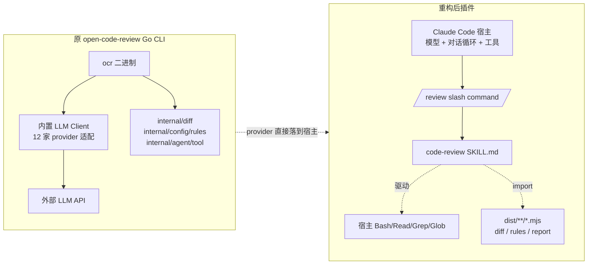
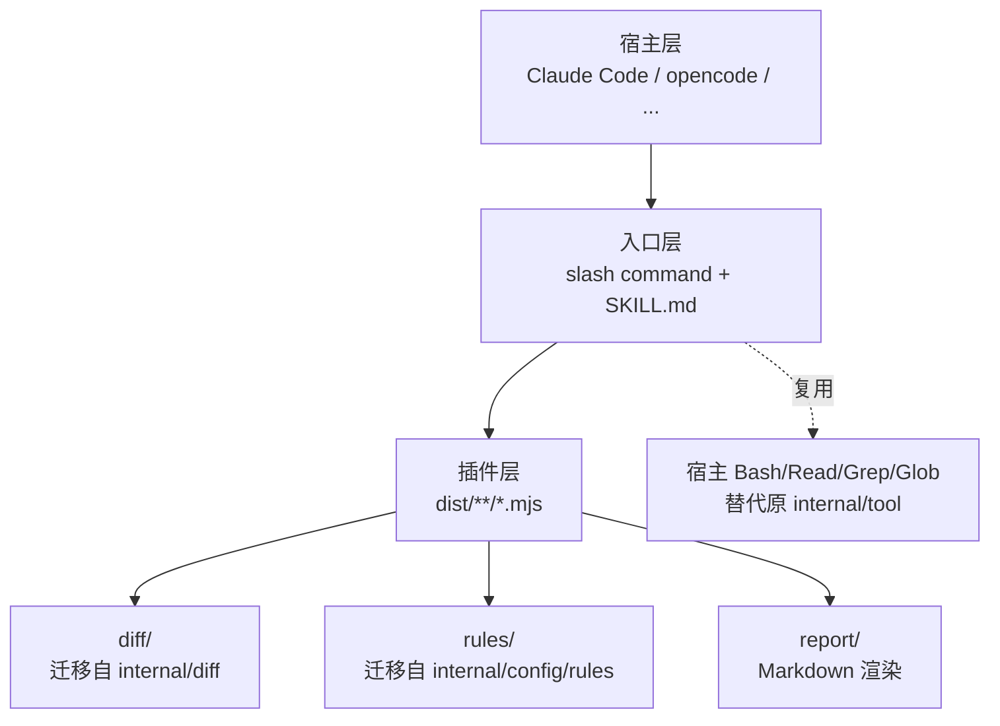

# 初始化共识 · refactor-as-plugin

> SDD 工作目录：`/Users/lixiangyang/Desktop/代码/open-code-review-plugin/codespec/changes/refactor-as-plugin`
> 项目根目录：`/Users/lixiangyang/Desktop/代码/open-code-review-plugin`
> 参考源项目：`/Users/lixiangyang/Desktop/代码/open-code-review`（阿里开源 Go CLI）
> 参考文档：`https://code.claude.com/docs/zh-CN/plugins`
> 更新时间：2026-06-23

---

## 1. 项目概述（核心问题）

将阿里开源的 **`open-code-review`**（Go CLI，自带 LLM 调用链）重构为一个 **Claude Code 原生插件**：

- **去掉独立 LLM API 调用** —— 不再持有 `llm.url` / `auth_token` / 多 provider 适配；review 的「模型 provider」直接复用 Claude Code 宿主
- **最大化复用原项目逻辑** —— `internal/diff/`（git/parser/hunk/relocation/resolver/workspace_file）与 `internal/config/rules/` 等确定性模块按 1:1 语义迁移到 TypeScript
- **TS 源码 + `.mjs` 运行时** —— `tsc` 产物经 `scripts/build-mjs.mjs` 重命名 / 改写 import，Claude Code 通过 Node 直接 `import`
- **以宿主钩子 + 插件机制承载工作流** —— 入口为 `commands/review.md`（slash command）与 `skills/code-review/SKILL.md`，未来可平移到 opencode 等同类宿主

> 图示：原 CLI 自带 LLM 链路；重构后插件只保留确定性工程（diff / rules / report），LLM provider 回归到宿主对话循环。

## 2. 关键目标

| # | 目标 | 验收要点 |
|---|------|---------|
| G1 | **形态转换**：CLI → Claude Code 插件目录 | `.claude-plugin/plugin.json` + `commands/review.md` + `skills/code-review/SKILL.md` 三件套就位 |
| G2 | **去 LLM 化**：移除所有外部 API 调用、凭证、协议适配 | 全仓库 0 处 `auth_token` / `llm.url` / SSE / provider switch；`internal/llm/`、`internal/agent/`、`internal/tool/` 全部不迁移 |
| G3 | **复用原项目核心算法** | 1:1 迁移 `internal/diff/{git,parser,hunk,relocation,resolver,workspace_file}.go` 与 `internal/config/rules/`；保留原测试用例语义 |
| G4 | **TS + ESM + .mjs 构建链路打通** | `npm run build` 产出 `dist/**/*.mjs`，Claude Code 可直接 `import` |
| G5 | **宿主无感的 provider 抽象** | review 提示词、决策、token 全部由宿主承担；插件侧无任何模型调用代码 |
| G6 | **可扩展到 opencode 等同类宿主** | 入口约定（slash command + skill + mjs 导出）与 Claude Code 解耦，仅依赖「宿主对话 + Bash/Read/Grep 工具」抽象 |

> 图示：插件分三层；宿主层可替换，入口层是契约边界，插件层只做确定性逻辑。

## 3. 范围与边界（要点）

- **纳入**：插件目录骨架、TS → `.mjs` 构建链、`internal/diff/` 与 `internal/config/rules/` 的 TS 重写、Markdown 报告渲染、`/review` 与 SKILL.md
- **不纳入**：任何 LLM Client / token 计数 / SSE / 多 provider 适配；`internal/agent/`、`internal/tool/`、`internal/llm/`；CLI 二进制发布与自动更新
- **保留扩展位**：入口契约对宿主透明，opencode 等场景的适配留给后续阶段

## 4. 主要风险（初步识别）

- **R1** —— SKILL → mjs 调用协议在官方文档中不显式，可能需通过 slash command 间接驱动
- **R2** —— `tsc → .js → .mjs` 的相对 import 改写存在解析陷阱（需 `moduleResolution: bundler` + 后处理脚本）
- **R3** —— 本地需 Claude Code 宿主可加载插件，否则验证阻塞（降级：先 `node dist/index.mjs` 单独跑）
- **R4** —— `internal/diff/resolver.go` 体量大、重定位逻辑复杂，需分级迁移（MVP → 高级特性）
- **R5** —— 宿主 Bash 工具的 sandbox 限制可能影响 git 命令执行

## 5. SDD 流程计划

后续按顺序推进，每阶段产物写入 `/Users/lixiangyang/Desktop/代码/open-code-review-plugin/codespec/changes/refactor-as-plugin/`：

1. **proposal.md** —— 需求澄清：功能清单、用户故事、影响范围、DFX
2. **spec.md** —— 需求规格：slash command 契约、SKILL.md 输入/输出、数据 schema、错误处理
3. **design.md** —— 架构设计：模块拆分、接口签名、TS→mjs 构建链细节、核心算法迁移映射
4. **task.md** —— 可执行任务清单与依赖关系
5. **实施与验证** —— 按 task.md 推进，最终在本地 Claude Code 宿主端到端验证

当前阶段（init）仅完成共识对齐，不展开任何接口设计、算法细节或任务拆解；具体内容由后续阶段产出。

---

## 用户原始需求

来实现 opencodereview_plugin，是想实现claudecode的插件，而不用想open code review那样子单独去调用独立的api；

具体需求为上边介绍， 可参考资料：/Users/lixiangyang/Desktop/代码/open-code-review/ open-code-review源代码、代码阅读和样例，我期望最后使用ts来实现，执行的时候用js、mjs等来执行； 你可以使用 https://code.claude.com/docs/zh-CN/plugins ，查看插件怎么安装，同时我本地也安装了ClaudeCode，可供验证；

我期望你尽可能是复用原有逻辑和代码，使用ClaudeCode本身的钩子+plugin来实现 open-code-review能够在代码上的provider直接调用的ClaudeCode的，同时期望后续也能扩展到opencode等场景上；
