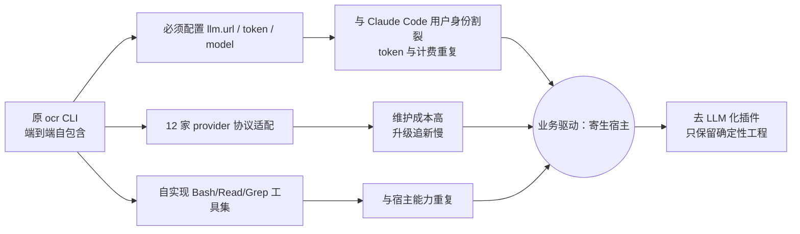
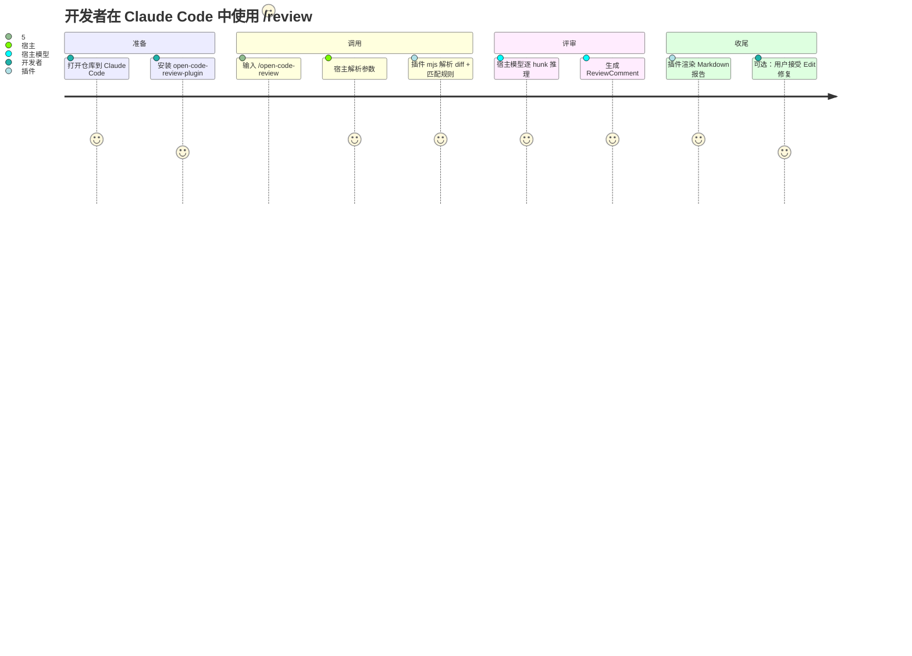
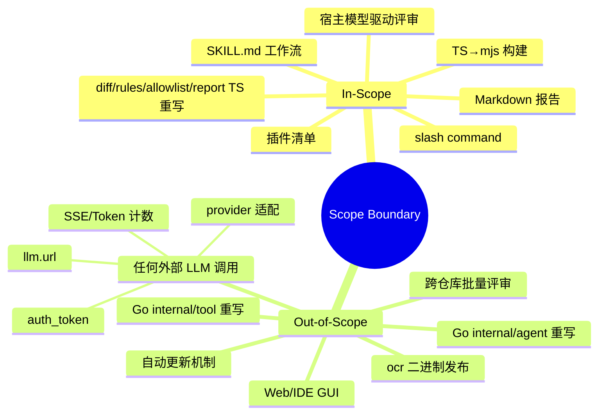
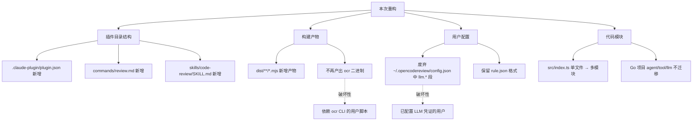

# AR-001 需求澄清 · refactor-as-plugin

> 工作目录：`/Users/lixiangyang/Desktop/代码/open-code-review-plugin/codespec/changes/refactor-as-plugin`
> 参考源项目：`/Users/lixiangyang/Desktop/代码/open-code-review`
> Claude Code 插件文档：`https://code.claude.com/docs/zh-CN/plugins`

---

## 1. 背景与动机

### 1.1 现状痛点

阿里开源的 [`open-code-review`](https://github.com/alibaba/open-code-review) 是一个端到端自包含的 Go CLI（`ocr` 二进制），其每个 review 流程都必须自带一整套 LLM 调用基础设施。基于 `/Users/lixiangyang/Desktop/代码/open-code-review/internal/` 实际目录与文件大小的事实：

| 子包（代码依据） | 体量 | 当前承担的工作 |
|---|---|---|
| `internal/llm/` | 11 个文件，独立 LLM 客户端 | 认证、Endpoint、SSE 流式、Token 计数、12 家 provider 协议适配 |
| `internal/agent/agent.go` | ~49 KB | Agent 主循环、提示词调优、工具调度、反思 |
| `internal/tool/` | 14 项 | 自实现 Read / Grep / Bash 等工具集 |
| `internal/diff/` | 12 个 `.go`（含测试），核心 `resolver.go` ~5.7 KB、`git.go` ~9.3 KB | git diff 解析、hunk 切分、行号重定位（**确定性**） |
| `internal/config/rules/system_rules.go` | ~12 KB + `rule_docs/*` 模板 | path-based 规则匹配（**确定性**） |
| `internal/config/allowlist/` | `supported_file_types.json`（66 种扩展名）+ `default_exclude_patterns.json`（16 条 glob） | 文件类型过滤（**确定性**） |

由此导致：
- **用户必须配置 `llm.url` / `auth_token` / `model`**（来自 `~/.opencodereview/config.json`），与 Claude Code 用户身份割裂；
- **同一台机器上 Claude Code 已经有可用模型**，但 `ocr` 二进制必须重新挂一份 API，token 与计费链路重复；
- **多 provider 适配（12 家）维护成本高**，而 Claude Code 插件生态可以让宿主完全吸收这部分复杂度；
- 当前仓库 `src/index.ts`（115 行）已经是一个**单文件占位实现**（`review()` 仅返回 `not-implemented`），骨架就绪但模块未拆分，急需通过 SDD 推进为可用产品。

> 图示：现状痛点 → 业务驱动 → 重构方向的因果链。

### 1.2 业务驱动

- **D1 复用宿主能力**：Claude Code 自带模型、对话循环与 Bash/Read/Grep/Glob/Edit 工具集；插件无需再造（代码依据：`skills/code-review/SKILL.md` 第 23–26 行明确依赖宿主工具）。
- **D2 零凭证零配置**：用户不必再准备 LLM 凭证；插件级配置只保留规则与过滤（代码依据：`commands/review.md` 第 53–54 行 Constraints "Never invent or hardcode API keys"）。
- **D3 复用阿里项目的"确定性工程"红利**：原项目 F1=0.74 / 准确率 0.86 / 召回率 0.65（30k token / ~3 分钟）的关键收益来自 `internal/diff/` + `internal/config/rules/` + `internal/config/allowlist/` 这一层；这部分**完全 TS 重写即可保留**。
- **D4 可移植到 opencode 等同形态宿主**：以 SKILL.md + slash command + 纯 `.mjs` 工具模块的形态发布，与具体宿主解耦，便于二期扩展到 opencode 等支持插件协议的代理框架。

## 2. 变更内容

### 2.1 功能清单

| 功能ID | 功能名称 | 优先级 | 说明（代码依据） |
|--------|----------|--------|-----------------|
| F-01 | `.claude-plugin/plugin.json` 插件清单 | P0 | 已存在（`/Users/lixiangyang/Desktop/代码/open-code-review-plugin/.claude-plugin/plugin.json`），声明 `commands[]` + `skills[]` 路径，需在 design 阶段对齐文档语义 |
| F-02 | `/open-code-review:review` slash command | P0 | 已存在 `commands/review.md`，接受 `--commit / --from / --to / --background / --rule / --repo` 参数（行 11–18） |
| F-03 | `code-review` SKILL：6 步工作流 | P0 | 已存在 `skills/code-review/SKILL.md`，定义 Discover → Parse → Match → Review → Render → Fix（行 47–125） |
| F-04 | TS → `.mjs` 构建链路 | P0 | `package.json` 已配置 `build:tsc + build:mjs`（第 19–24 行）、`scripts/build-mjs.mjs` 已存在 |
| F-05 | `src/diff/` 模块（diff 解析） | P0 | TS 重写 `internal/diff/parser.go` + `hunk.go` + `git.go` + `workspace_file.go` |
| F-06 | `src/rules/` 模块（规则匹配） | P0 | TS 重写 `internal/config/rules/system_rules.go`（含 ordered path-rule map）+ 内嵌默认规则文档 |
| F-07 | `src/allowlist/` 模块（文件过滤） | P0 | TS 重写 `internal/config/allowlist/allowed_ext.go` + 复用 `supported_file_types.json` + `default_exclude_patterns.json` |
| F-08 | `src/report/` 模块（Markdown 渲染） | P0 | 按 `SKILL.md` 行 105–118 报告骨架渲染；High/Medium 显示，Low 静默丢弃 |
| F-09 | 公共类型 `DiffEntry / ReviewComment / ReviewReport` | P0 | 已在 `src/index.ts` 第 34–73 行就位，需后续 spec 阶段冻结 |
| F-10 | `src/diff/resolver.ts` 行号重定位（高级） | P1 | 对应 `internal/diff/relocation.go + resolver.go`；MVP 可缺省，二期增补 |
| F-11 | `src/diff/relocation.ts` 反思组件 | P1 | 同上 |
| F-12 | 支持外部 `rule.json`（CLI / 项目 / 用户级） | P0 | SKILL.md 第 64–79 行已声明优先级 |
| F-13 | 与 opencode 等同形态宿主的兼容层 | P2 | 二期：抽出 SKILL.md / commands 的宿主无关声明 |
| F-14 | 端到端 ClaudeCode 宿主验证 | P0 | 本地已安装 Claude Code，可加载插件目录 |
| F-15 | 单元测试（diff / rules / report） | P1 | 对照原项目 `*_test.go`（含 `resolver_test.go` ~22 KB） |

> 优先级定义：P0 MVP 必须；P1 重要增强（覆盖高级算法 + 测试）；P2 未来优化（多宿主兼容）。

### 2.2 用户故事

**US-01**：作为开发者，我希望在 Claude Code 中直接运行 `/open-code-review:review`，让宿主模型评审我当前工作区的改动，无需任何 API 凭证。

**验收标准**：
- [ ] 仓库根目录无 `~/.opencodereview/config.json` / 无任何 LLM 环境变量时，命令依然能正常完成
- [ ] 输出 Markdown 报告包含 `Files reviewed / Issues found` 摘要与 High/Medium 列表
- [ ] 报告中不包含任何 Low 级别条目
- [ ] 插件代码全文检索 `auth_token` / `llm.url` / `fetch(` / `axios` 均无命中（仅做防御性自检）

**US-02**：作为 reviewer，我希望对单个 commit 或两个 ref 之间的 diff 触发评审。

**验收标准**：
- [ ] `--commit <sha>` 走 `git show --name-status <sha>` + `git diff <sha>^..<sha>`（SKILL.md 第 50–53 行）
- [ ] `--from <a> --to <b>` 走 `git diff --name-status a..b` + `git diff a..b`
- [ ] 解析后的 `DiffEntry.status` 正确映射 `added / modified / deleted / renamed`

**US-03**：作为团队管理员，我希望提供项目级 `.opencodereview/rule.json`，自定义按路径的评审重点。

**验收标准**：
- [ ] 规则解析优先级：`--rule <path>` > `<repo>/.opencodereview/rule.json` > `~/.opencodereview/rule.json` > 内嵌默认（SKILL.md 第 64–69 行）
- [ ] path-rule map **保序匹配**（对应 Go 端 `system_rules.go` `UnmarshalJSON` 显式保序逻辑，第 31–80 行）

**US-04**：作为开发者，我希望"review and fix"一句话指令能让 Claude Code 自动应用安全修复。

**验收标准**：
- [ ] 仅 High 级别且 `suggestion` 字段非空的条目可被自动 Edit 应用
- [ ] Medium 与无 `suggestion` 的条目仅列出建议
- [ ] 修复后报告标注每条是 "applied" / "suggested"

**US-05**：作为插件作者，我希望同一份 SKILL.md + `.mjs` 工具模块未来能在 opencode 等其他宿主中复用。

**验收标准**（P2）：
- [ ] 工具模块对 Claude Code 特有 API 零依赖
- [ ] SKILL.md 中除 "host model" 抽象外不耦合 ClaudeCode 命名

### 2.3 不在范围内

- ❌ 任何形式的 LLM API Client、Token 计数、SSE 流式解析、多 provider 适配
- ❌ Go `internal/agent/`（49 KB Agent 主循环）与 `internal/tool/`（14 项工具）的 TS 重写——由宿主能力替代
- ❌ Go `internal/llm/`、`internal/session/`、`internal/telemetry/` 的迁移
- ❌ 原 CLI `bin/` 二进制发布、npm 全局安装、自动更新
- ❌ Web 端 viewer（`internal/viewer/`）
- ❌ 跨仓库 / 多仓库批量评审场景（首版仅当前 cwd 仓库）
- ❌ 评审历史持久化、telemetry 数据上报

## 3. 影响分析

### 3.1 受影响的规格

| 规格章节 | 变更类型 | 说明 |
|----------|----------|------|
| spec §1 命令契约 | 新增 | 冻结 `/open-code-review:review` 的 `$ARGUMENTS` 文法与错误处理 |
| spec §2 SKILL 输入/输出 | 新增 | 锁定 6 步工作流的输入/输出 schema |
| spec §3 数据模型 | 新增 | 冻结 `DiffEntry / ReviewComment / ReviewReport`（当前在 `src/index.ts` 第 34–73 行） |
| spec §4 规则文件格式 | 对齐 | 与原项目 `{ rules: [{ path, rule }] }` 完全对齐（SKILL.md 第 71–79 行示例） |
| spec §5 错误处理 | 新增 | 非 git 仓库、空 diff、规则文件解析失败的降级路径 |

### 3.2 受影响的设计

| 设计章节 | 变更类型 | 说明 |
|----------|----------|------|
| design §1 模块拆分 | 新增 | `src/index.ts` 单文件 → `diff / rules / allowlist / report / types` 子目录 |
| design §2 接口签名 | 新增 | `parseDiff` / `parseHunks` / `resolveRule` / `filterFiles` / `renderReport` 函数签名 |
| design §3 构建链 | 细化 | `tsc(.js) → build-mjs.mjs(.mjs + 改写 import)` 的相对路径处理 |
| design §4 核心算法 | 新增 | hunk 解析的状态机（对应 Go `parser.go` 第 35–110 行）、ordered path-rule map（对应 Go `system_rules.go` 第 31–80 行）、glob doublestar 的 TS 等价物 |
| design §5 宿主-插件交互序列 | 新增 | slash command → SKILL → host tools → mjs 模块的调用时序 |

### 3.3 破坏性变更

- **是否有破坏性变更**：是（仅对原 Go 项目的现有用户）
- **影响范围**：
  - 依赖 `ocr` CLI 的脚本与 CI 任务（命令名、参数、退出码均改变）
  - 已配置 `~/.opencodereview/config.json` 中 LLM 凭证的用户（凭证字段被忽略）
- **迁移方案**：
  - 文档明确说明本仓库是**独立的 Claude Code 插件实现**，不替换原 Go 项目；
  - 提供"从 `ocr` 迁移到插件"的 README 章节，指引：（1）卸载 `ocr` 二进制；（2）删除 `llm.*` 配置段；（3）将 `rule.json` 移动到 `.opencodereview/rule.json` 保留；（4）在 Claude Code 中安装本插件。

### 3.4 依赖关系

**运行时依赖**（零运行时依赖优先策略，对应 init.md §4.1）：

| 依赖 | 必需性 | 说明 |
|------|--------|------|
| Node.js ≥ 18 | 必需 | 原生 ESM、`.mjs`、fetch（仅供未来使用） |
| Claude Code 宿主 | 必需 | 提供 Bash/Read/Grep/Edit 工具与模型 |
| 第三方 glob 库（如 `picomatch`） | **待确认** | 替代 Go 端 `github.com/bmatcuk/doublestar/v4`；如能自实现 `**`/`{a,b}` 子集则零依赖（在 design 阶段决策） |

**构建时依赖**：

| 依赖 | 用途 |
|------|------|
| `typescript ^5.5.0` | 编译（已在 `package.json` devDependencies） |
| `@types/node ^20.14.0` | Node 类型 |

**上游参考**：`/Users/lixiangyang/Desktop/代码/open-code-review/internal/diff/`、`internal/config/rules/`、`internal/config/allowlist/`（用作算法对照与测试基线）。

## 4. DFX 约束

### 4.1 性能

| 约束项 | 指标 | 优先级 |
|--------|------|--------|
| 单个 PR 评审端到端耗时 | ≤ 5 min（对照原项目 ~3 min，扣除宿主推理差异） | P0 |
| 单文件 diff 解析（含 hunk 切分） | ≤ 50 ms / 1k 行 | P0 |
| 规则匹配（200 个 path-rule × 500 个文件） | ≤ 100 ms | P0 |
| Markdown 报告渲染（200 条评论） | ≤ 50 ms | P1 |
| 插件冷加载（首次 `import dist/index.mjs`） | ≤ 200 ms | P1 |
| Token 消耗（30 文件 diff，对照原项目基准 30k） | 不做硬约束（由宿主模型决定） | P2 |

### 4.2 可靠性

| 约束项 | 要求 | 优先级 |
|--------|------|--------|
| 非 git 仓库目录 | 明确报错，不抛未捕获异常 | P0 |
| 空 diff（无任何改动） | 输出 "no changes" 提示并 0 退出 | P0 |
| 二进制文件 | 自动跳过（对照 `parser.go` 第 56 行 `binaryRe`），不写入报告 | P0 |
| 超大单文件 diff（> 1 MB） | hunk-by-hunk 分批迭代（SKILL.md 第 56 行约束 "No silent truncation"） | P0 |
| 规则 JSON 解析失败 | 降级到内嵌默认规则，stderr 打印 warning | P0 |
| 无 LLM 调用 | 防御性自检：源码 grep 零命中 LLM 关键字 | P0 |
| 修复时文件已被外部修改 | Edit 失败后回滚并报告，不破坏用户工作区 | P0 |
| 宿主 Bash 工具被拒绝 | 给出明确的"需要 Bash 权限"提示 | P1 |

## 5. 里程碑

| 里程碑 | 交付内容 | 完成标志 |
|--------|----------|----------|
| **M1 SDD 共识** | init.md / proposal.md / spec.md / design.md / task.md 完整 | 5 份文档评审通过 |
| **M2 骨架与构建链** | `src/types.ts` + 空目录 `diff/rules/allowlist/report` + `npm run build` 通过 | `dist/**/*.mjs` 全部生成、`typecheck` 0 错误 |
| **M3 diff 解析 MVP** | `src/diff/parser.ts` + `hunk.ts` + `git.ts`，对照 Go 测试用例移植 | `parseDiff(text)` 通过原项目 `parser_test.go / hunk_test.go` 等价用例 |
| **M4 规则 + 过滤** | `src/rules/`（含保序 path-rule map）+ `src/allowlist/`（含 `supported_file_types.json` 内嵌） | 200 文件 × 200 规则匹配 ≤ 100 ms |
| **M5 报告渲染** | `src/report/index.ts`，按 SKILL 6 步骤完整生成 Markdown | 与 SKILL.md 行 105–118 骨架字符串等价 |
| **M6 宿主端到端验证** | 在本地 Claude Code 中加载插件，跑通 `--workspace / --commit / --from..to` | 3 种模式各跑通 1 个真实 PR / commit |
| **M7 P1 增强** | 行号重定位 + 单测覆盖率 ≥ 70% + 修复链路 | resolver/relocation 测试通过；review-and-fix 双场景手测通过 |
| **M8 文档与发布** | README（含从 `ocr` 迁移指引）+ examples/ + CHANGELOG | 文档评审通过，标签 `v0.2.0` |

---

## 待确认问题（继承自 init.md §6.2 并细化）

| # | 问题 | 期望解答阶段 |
|---|------|-------------|
| Q1 | `plugin.json` 中 `skills[]` 的具体加载语义（是否支持 mjs 入口） | design |
| Q2 | `dist/index.mjs` 暴露粒度：单一 `review()` vs 原子函数集合 | spec |
| Q3 | `rule.json` 是否完全对齐原项目 `{ rules:[{path,rule}] }` 还是引入 `path_rule_map` 保序结构 | spec |
| Q4 | 是否引入第三方 `picomatch`，或自实现 `**`+`{a,b}` 子集（影响 R5/D4） | design |
| Q5 | 是否在 MVP 包含 review-and-fix（F-04）还是延后到 M7 | spec |
| Q6 | M6 端到端验证最低 ClaudeCode 版本要求 | design |

→ 上述问题进入下一阶段（spec.md）前需逐项澄清；如用户在阅读本提案时希望先行决策，可在评审反馈中指出。

— END OF AR-001 PROPOSAL —
