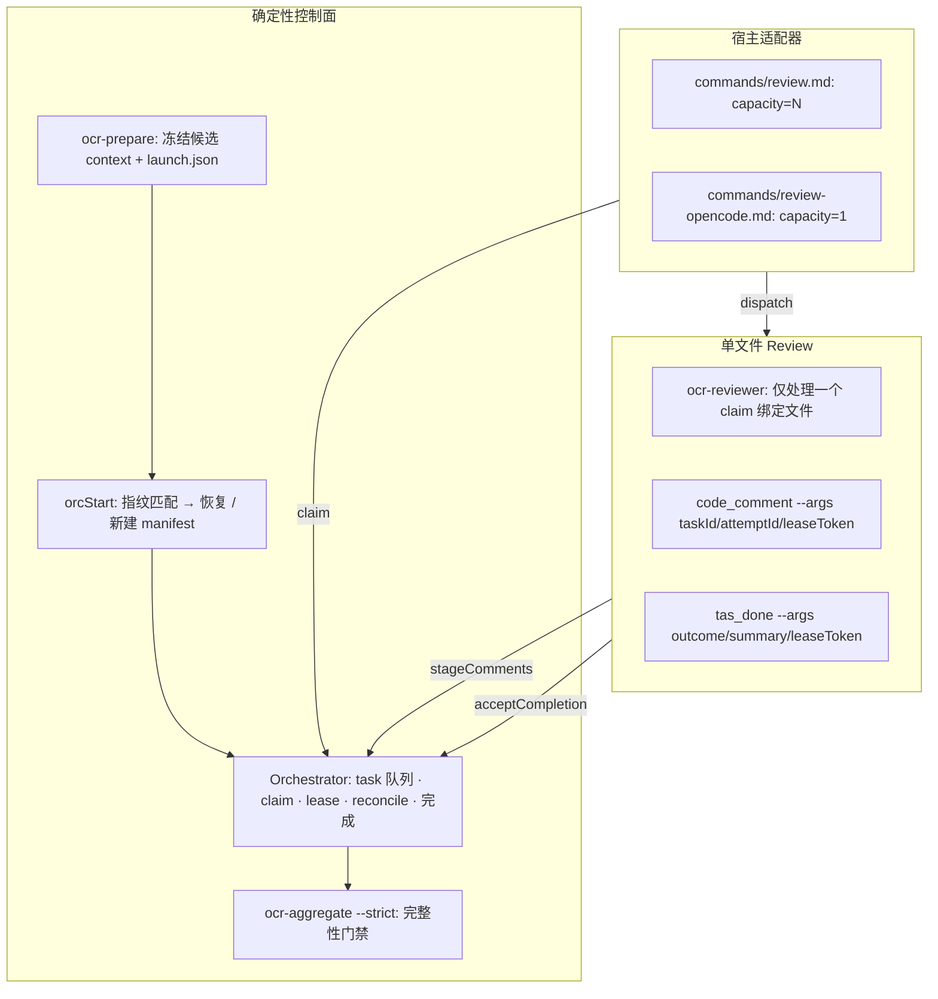

# Deterministic Review Orchestration — 设计实现文档

> 状态：已实现并合并到 main（`0dffc5d`）
> PR：[#12](https://github.com/xjtulixiangyang/open_code_review_plugin/pull/12)
> 设计规格：[docs/superpowers/specs/2026-07-13-review-orchestration-control-design.md](../../docs/superpowers/specs/2026-07-13-review-orchestration-control-design.md)

## 概述

将审查编排从"prompt 约定"升级为 TypeScript 确定性 pull orchestrator。内核通过不可变 manifest、lease-bound task、结构化完成和严格聚合门禁，程序化保证每个 eligible diff 文件都被审查且仅被一个 accepted attempt 审查。Claude Code 与 OpenCode 复用同一状态机，仅并发能力不同。

## 核心问题

1. **调度不可靠**：旧 `commands/review.md` 由主 agent 解释文件队列和重试策略，可能遗漏文件、提前聚合或错误报告成功。
2. **完成不可验证**：`done/*.json` 仅证明调用了 `task_done`，不证明对应预期文件、不受 lease 保护、不保证完整性。
3. **恢复不一致**：`--resume` 依赖用户传入旧 runId，无法自动匹配相同快照。
4. **双宿主漂移**：Claude Code 和 OpenCode 各自维护调度文案，核心策略尚未统一。

## 架构概览



> 控制面由 CLI 程序拥有；宿主只负责机械 claim → dispatch → reconcile 循环。

## 文件布局

```text
src/core/orchestrator/
  types.ts         # 所有状态枚举与数据契约（schema 版本 1）
  storage.ts       # 原子 JSON 写 + JSONL 追加（write-file-atomic 5.x）
  lock.ts          # run 级目录锁：所有权、过期接管、非重入
  fingerprint.ts   # SHA-256 指纹：repo、launch、diff、逐文件
  manifest.ts      # 不可变 manifest、有效 run 选择、supersede
  orchestrator.ts  # 任务状态机：claim/ack/fail/reconcile/complete/aggregate
  comments.ts      # 权威评论源（schema 感知）

src/cli/
  orchestrator_start.ts       # ocr-orchestrator-start
  orchestrator_claim.ts       # ocr-orchestrator-claim
  orchestrator_ack.ts         # ocr-orchestrator-ack
  orchestrator_dispatch_fail.ts
  orchestrator_reconcile.ts
  orchestrator_status.ts
  orchestrator_helpers.ts     # 共享：parseProtocolArgs · resolveRunDir

commands/
  review.md           # 共享 ORCHESTRATOR-PROTOCOL 标记段，capacity=N
  review-opencode.md  # 共享 ORCHESTRATOR-PROTOCOL 标记段，capacity=1
agents/
  ocr-reviewer.md / ocr-reviewer-opencode.md  # 结构化 task_done
skills/ocr-review-file/SKILL.md               # 结构化 code_comment
```

## 状态机

### Task

```text
queued → leased → running → succeeded
                ↘           (findings / no_findings)
                  failed（attempts 耗尽）
     ↑ lease 过期或 dispatch failure 且 attempts 未耗尽 → queued
```

- `attemptsUsed` 在 claim 时递增；已在 `running` 的任务不能被 `failAttempt` 回退（只能 lease 过期）。
- 只有当前 `leased`/`running` attempt 可以完成或被重试。
- `currentAttemptId` / `acceptedAttemptId` 防止串用和重复完成。

### Run

```text
active ──→ completed（全部 succeeded）
       ──→ failed（全部终态且存在 failed）
       ──→ superseded（同仓库 snapshot 变化，被新 run 取代）
```

- 状态从 task 记录推导，不依赖缓存计数。
- `completed` 和 `failed` 是终态且不可逆。

### 完成幂等性

```text
task_done 提交：
  SHA-256(runId \0 taskId \0 attemptId \0 tokenDigest \0 outcome \0 ...)
  → digest 与已有 accepted attempt 的 completionDigest 相同 → 幂等成功
  → digest 不同且有 accepted attempt     → 拒绝（冲突完成）
  → 否则 → 校验 lease / attempt / outcome / comment 一致性 → 写入成功
```

## 关键不变量

| 不变量 | 实施方式 |
|---|---|
| N 个 eligible 文件 → N 个逻辑 task | `buildManifest` 迭代 `context.files`，每个文件创建一个 `task-<index>` |
| 每个 task 最多一个 accepted attempt | `acceptCompletion` 成功时设置 `acceptedAttemptId`，重复调用仅接受相同 digest |
| 未 claim 的 task 不能完成 | `acceptCompletion` 要求 `task.state === 'running'` 且 `task.currentAttemptId === attemptId` |
| 错误凭证不能改变状态 | SHA-256 token digest、file path/diff fingerprint、run/attempt 交叉引用校验 |
| 过期 lease 不产生重复评论 | 评论先写入 attempt 暂存区，仅成功 attempt 的评论进入聚合 |
| 任一文件失败 → 整次审查失败 | strict aggregate exit 1 写入诊断报告 |
| 相同快照自动恢复 | `selectEffectiveRun` 匹配 repo+launch+diff 指纹 |
| diff 变化不跨快照复用 | 旧 run → superseded，新建候选 run |

## 并发控制

- **run 锁**：`mkdir(.orchestrator.lock)` 原子获取，`owner.json` 记录所有者与过期时间；非重入检测。
- **lease**：默认 900s，每 300s 续期；超时由 `reconcile()` 回收。
- **claim**：run 级容量（`capacity - occupied = available`），防止宿主超额调度。

## Pull 协议

```text
prepare → 候选 runId
orc-start --runId <candidate> → { effectiveRunId, resumed, state, taskCounts }
loop:
  reconcile --runId <effectiveRunId>
  claim --runId <effectiveRunId> --capacity <n> → ClaimResult[]
  dispatch + ack / dispatch-fail
  per-file PLAN + reviewer + task_done
until terminal
filter / relocate
aggregate --strict true
```

## 测试覆盖

| 层 | 文件 | 覆盖内容 |
|---|---|---|
| 状态机 | `claim.test.ts` | claim/ack/fail 转换、并发、容量上限 |
| | `completion.test.ts` | 幂等完成、冲突拒绝、outcome 一致性 |
| | `reconcile.test.ts` | lease 过期、重试、终态 |
| 存储/锁 | `lock.test.ts` | 获取/释放、过期接管、并发互斥、重入拒绝 |
| | `storage.test.ts` | 原子写、JSONL 追加、事件 |
| 快照/恢复 | `manifest.test.ts` | fresh、exact resume、supersede、legacy 不恢复 |
| 评论 | `code_comment.test.ts` | stageComments 校验、token/expiry/path 拒绝 |
| 聚合 | `aggregate_strict.test.ts` | completed/failed/active 退出语义、诊断报告、filter/relocate |
| 真实 CLI | `bin/` 临时仓库 | findings+no_findings、resume、supersede、dispatch 耗尽 |
| 宿主协议 | `protocol_sync.test.ts` | 两个 command 共享协议段不变 |
| 端到端 | `roundtrip.test.ts` (扩展) | 完整 lifecycle |

## 已知限制

- `.ocr-runs/**` 已从 workspace diff 排除；如未来有嵌套 `.ocr-runs` 路径需要同样处理。
- run 锁的 `serialQueues` 不自动清理（惰性删除并依赖 GC），长生命周期场景建议后清理。
- 网络不可用时 `ocr-claim` 静默返回空数组，不会错误创建 lease；宿主应按 `nextLeaseDeadline` 等待而非 busy poll。
